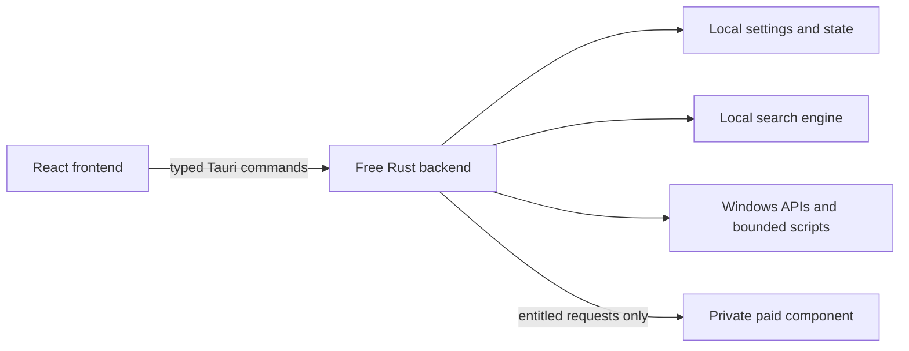

# Architecture — WinCommander public repository

This document describes the public Free application and the published
open-core boundary. Private Pro, Fleet service, Investigator, operational, and
acceptance designs are maintained outside this repository.

## Overview

WinCommander Free is a Windows desktop application built with Tauri v2. A
React/TypeScript frontend calls a Rust backend through Tauri commands. Windows
operations are implemented in Rust or in encrypted PowerShell modules that are
decrypted only when dispatched.



The public app can display paid capabilities and request an entitled paid
operation, but the private implementation and its enforcement remain outside
the AGPL repository. UI locks are a presentation aid; backend entitlement
checks are the authority.

## Public components

| Component | Responsibility | Public source |
| :-- | :-- | :-- |
| Frontend | Navigation, panels, settings UI, local status, and upgrade presentation | `src/` |
| Feature registry | User-visible labels, risk metadata, and Free/paid classification | `src/registry/` |
| Free backend | Tauri lifecycle, validated commands, local state, and public Windows integrations | `src-tauri/commander-free/` |
| Shared contracts | Data-only inter-process and fleet wire contracts | `src-tauri/wincmd-shared/`, `src-tauri/fleet-proto/` |
| Fleet client primitives | Neutral transport/client loop shared across products | `src-tauri/fleet-agent-core/` |
| Content search | Local keyword indexing and extraction | `src-tauri/wincmd-search/` |
| Build and checks | Encryption, code generation, tier validation, and release checks | `tools/` |

## Data and trust boundaries

- Frontend input is untrusted. Rust validates paths, identifiers, arguments,
  tier, risk, and administrative requirements before an operation runs.
- Free settings and local indexes remain on the device unless the user enrolls
  the device into an organization-managed Fleet service.
- Paid capabilities fail closed when entitlement or paid-component validation
  is unavailable.
- Shared crates contain neutral contracts and protocol primitives only. They
  are not a path for private implementation logic to enter the public binary.
- Destructive operations require explicit confirmation and backend validation;
  the frontend never supplies arbitrary shell commands.
- Update and licence trust roots are verified by the application. Secrets and
  signing material are never stored in this repository.

## Open-core model

The public repository contains the Free desktop application, its frontend, and
neutral shared contracts. Advanced local capabilities, Fleet services, and the
Investigator workflow are proprietary and require their corresponding
entitlements. See [OPEN_CORE.md](OPEN_CORE.md) for the authoritative licensing
boundary and [FEATURES.md](FEATURES.md) for the user-visible tier summary.

The split is deliberately one-way:

- public code may define neutral request/response types needed to call an
  entitled component;
- private source, private tests, internal comments, operational runbooks, and
  acceptance records must never be copied into this repository;
- a public feature description may explain behavior and limits, but not private
  implementation or internal readiness evidence.

## Settings model

WinCommander separates intended configuration from observed machine state.
The frontend expresses user intent; backend commands apply it; subsequent
status reads report the actual Windows state. Code schemas are authoritative:

- `src/types/settings.ts`
- `src-tauri/commander-free/src/settings.rs`
- `src/registry/*.toggles.ts`

Sensitive values are not placed in logs or public documentation. Detailed
storage, migration, managed-policy, and paid-command catalogs are private
engineering material.

## Build and verification

From the repository root:

```powershell
bun install
bun x tsc --noEmit
bun run lint
bun run lint:tiers
bun run gen:types:check
bun run lint:strings-free
```

From `src-tauri/`:

```powershell
cargo check --all-targets
cargo test --workspace
cargo clippy --workspace --all-targets -- -D warnings
```

Edits to plaintext backend PowerShell require `bun run encrypt-backend`.
Edits to shared wire types require `bun run gen:types` followed by the drift
check.

## Public references

- [README.md](README.md) — installation and use
- [FEATURES.md](FEATURES.md) — user-visible capabilities and tier boundaries
- [SECURITY.md](SECURITY.md) — public threat model and disclosure policy
- [docs/cli.md](docs/cli.md) — Free CLI behavior
