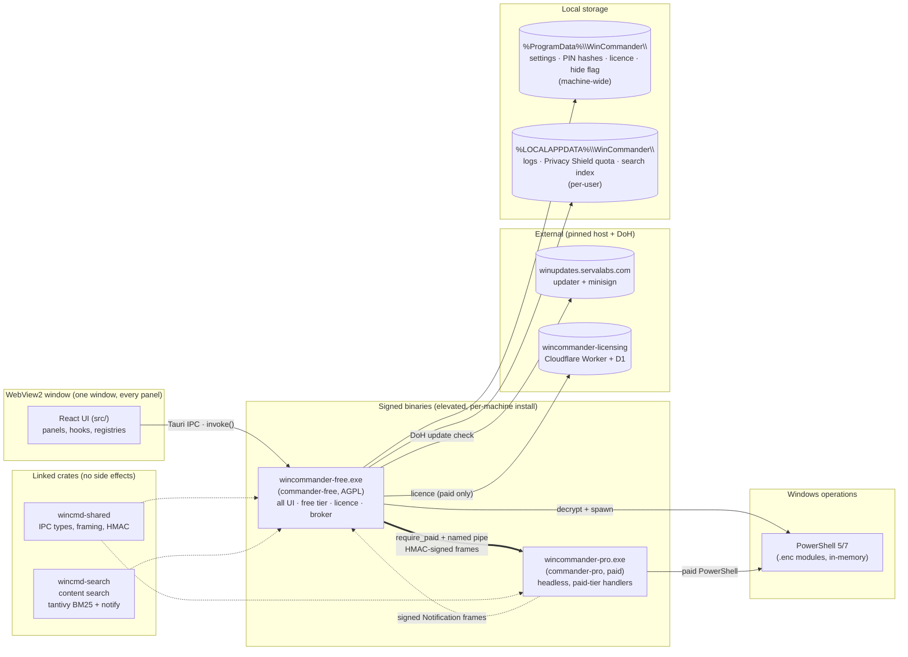

# Architecture — WinCommander

> How it's built. Code blocks and diagrams welcome. Facts here are derived from the source under
> `src-tauri/` and `src/`; the code is authoritative. Deeper references live in [`docs/`](docs/) —
> see [docs/ipc.md](docs/ipc.md) for the full Free ↔ Pro wire protocol, [docs/cli.md](docs/cli.md) for same-executable automation, and [docs/settings-reference.md](docs/settings-reference.md) for the settings tree.

## Overview

WinCommander is a Tauri v2 desktop app: a React/TypeScript frontend in a WebView2 window driving a Rust backend over Tauri IPC. The backend executes Windows operations through AES-256-GCM-encrypted PowerShell modules decrypted in memory per command. It ships as **two binaries** — `wincommander-free.exe` (open-source primary, AGPL) and `wincommander-pro.exe` (paid sidecar, governed by the [WinCommander EULA](https://servalabs.com/eula)) — that talk over a Windows named pipe; a third crate, `wincmd-shared`, defines the pure-data IPC types both link; a fourth crate, `wincmd-search`, is the reusable content-search engine owned in-process by `commander-free`. Two more permissive crates, `fleet-proto` and `fleet-agent-core`, hold the fleet wire-protocol SSOT and the generic fleet-client loop respectively — both are shared with TuxCommander (and, for the wire contract, with the Android agent via a golden-vector conformance fixture), not WinCommander-specific. The user sees one window with every panel; paid rows render locked until a licence/trial entitlement is present.



## Components

| Component | Responsibility | Location |
| :-- | :-- | :-- |
| Frontend SPA | UI, panel routing, state, IPC wrappers | `src/` (`App.tsx`, `main.tsx`) |
| External alert window | A dedicated transparent, borderless Tauri WebView renders the branded alert stack outside the main shell. The main-window bridge selects the monitor under the cursor (then the app/primary monitor), clamps the physical window to that monitor's DPI-aware work area, and positions it at the bottom-right without covering the taskbar. The alert WebView owns stacking, deduplication, timeout, dismissal, pointer passthrough while hidden, and light/dark rendering. | `src/components/ExternalNotificationBridge.tsx`, `src/components/CustomNotificationWindow.tsx`, `src/lib/notificationWindowPosition.ts`, `src-tauri/commander-free/src/native_notify.rs`, `src-tauri/commander-free/capabilities/notification-alerts.json` |
| Panel manifest | Single source of truth for panels (routing/sidebar/polling/prefetch). Primary rail order: Dashboard → Windows Settings → Privacy Settings → System Cleanup → Network Control → Packages & Apps → Secret Settings → Settings. | `src/types/panels.ts` |
| Visibility resolver | UI placement contract: density, capability bundles, dependencies, and cover unlock | `src/lib/visibility.ts`, `src/hooks/useVisibility.ts`, `src/lib/personaMigration.ts` |
| In-app guide + setup | One content SSOT (`GuideTopic[]`) → first-launch setup and the spotlight tour (highlights `data-tour` anchors); the help-center article system and per-panel contextual "?" were removed (2026-07-20) — the title-bar "?" now starts the contextual tour directly. `GuideHost` (mounted in `App.tsx`) owns first-launch Help auto-open when `app.firstRunComplete` is false; setup state/actions live in `useSetupGuide`, with pure helpers in `lib/setupGuide.ts`. Pure tour ordering in `lib/tour.ts`; communication over the `start-tour` window event | `src/content/guide/`, `src/components/guide/`, `src/hooks/useSetupGuide.ts`, `src/hooks/useTour.ts`, `src/lib/setupGuide.ts`, `src/lib/tour.ts` |
| Toggle registries | Declarative toggle/feature defs with tier + risk flags | `src/registry/*.toggles.ts`, `src/registry/features.ts`, `src/types/toggles.ts` |
| IPC wrapper layer | Typed `invoke()` calls + command dispatch | `src/hooks/useBackend.ts` |
| Entitlement (UI) | UI-only licence gating (`hasPaid`) | `src/hooks/useEntitlements.ts`, `LockedToggle.tsx`, `TierGate.tsx` |
| Free binary entry | Tauri builder, tray, hotkeys, window, command registration | `src-tauri/commander-free/src/lib.rs`, `main.rs` |
| Identity helpers | `app_display_name`, `app_display_name_with_edition`, `scheduled_task_launch_name`, `hidden_marker_suffix`, `hide_flag_path`, `firewall_rule_name` — single chokepoint so P4 can flip identity in one place | `src-tauri/commander-free/src/paths.rs` |
| Backend dispatcher | AES decrypt, data-driven tier registry (`COMMAND_REGISTRY`) with match fallback, module gate, PS dispatch, settings sync | `src-tauri/commander-free/src/backend.rs` |
| App-data store | Per-section at-rest-encoded persistence; `load`/`save`/`load_profile`/`save_profile`; `enc:v1:` + base64(nonce∥ciphertext), argon2id KDF, AES-256-GCM; per-install `.install.material` | `src-tauri/commander-free/src/datastore.rs` |
| Settings engine | `ideal`/`current` model, drift, patch, locked paths; `load_profile_section`/`save_profile_section` seams (P1 wires them) | `src-tauri/commander-free/src/settings.rs` |
| Licence layer | Ed25519 JWT verify, device binding, trial, grace, entitlement | `src-tauri/commander-free/src/license.rs` |
| Pro broker | Spawn Pro, handshake, signed dispatch, notifications | `src-tauri/commander-free/src/sidecar.rs` |
| Pro installer | Pinned-host download, SHA-256 verify, atomic install | `src-tauri/commander-free/src/pro_install.rs` |
| Shared IPC types | Envelope/Hello/Request/Response, framing, HMAC helpers | `src-tauri/wincmd-shared/src/lib.rs` |
| Fleet wire-protocol SSOT (`fleet-proto`) | Pure-data crate: fleet wire types (`ConfigEpoch`, `SignedCommand`, `ResolvedPolicy`, `ArgusSignal`, …) plus the canonical signing preimage builders (`epoch_preimage`, `canonical_command_bytes`, `policy_preimage`) and `verify_signature_b64`. Byte layout is pinned by frozen golden-vector tests — any change requires a coordinated deploy of every consumer (fleet-server, WinCommander, TuxCommander) plus re-signing outstanding epochs. `ts-codegen` feature (optional, build-only) drives the ts-rs → `bindings/fleet.ts` export; disabled by default so no production binary links `ts-rs`. No AV-flagged command strings appear here — remote actions reference a `catalog_id`. | `src-tauri/fleet-proto/` |
| Fleet agent client (`fleet-agent-core`) | Generic fleet-client loop shared by every ServaLabs product's fleet agent (WinCommander Pro, TuxCommander): enroll → HMAC-authenticated check-in → ed25519 command verify → dispatch, plus dead-man accounting. Ships as a `types`/`transport` feature split: `types` (default-features off) re-exports `fleet-proto` and the pure `verify::verify_command`/`dispatch::process_checkin` path with **zero `reqwest`/`tokio`** in the dependency closure, so a Free-tier binary can verify a signed command locally without linking any transport code (keeps the `strings-grep-free` AV-hygiene gate clean); `transport` (default) adds the background enroll/check-in HTTP loop, exponential-backoff-with-jitter, and optional SPKI TLS pinning. Platforms implement the `FleetActions` trait (`raise_posture`/`duress_seal`/`duress_wipe`/`all_clear`/`dead_man_miss`/`record_trigger_source`) and a `SecretStore` for the check-in secret; the five destruction/trigger gates stay platform-owned — this crate only requests actions through the same authenticated path as any other trigger source. | `src-tauri/fleet-agent-core/src/{lib,config,state,verify,dispatch,transport,pinning,util}.rs` |
| Pro sidecar | Headless paid-command handlers + watchers (separate repo): `feature_id → handler` dispatch (`handlers.rs`) plus dedicated modules — see Pro modules table below | `commander-pro` crate (`../commander-pro/`) |
| Session-assurance event store (Pro, M1) | Encrypted, append-only monitoring event store. AES-256-GCM per-field with `enc:v1:<key_id>` + AAD; tamper-quarantine on GCM failure; no rusqlite. | `commander-pro/src/event_store/{mod,envelope,record_crypto,store_lines,master_key}.rs` |
| Shared services | One `WH_KEYBOARD_LL` hook + one `notify` watcher per root, fan-out | `src-tauri/commander-free/src/services/` |
| Content-search engine (`wincmd-search`) | AGPL workspace crate; recursive crawl + `notify` live file-watch → text extraction (txt/md/html/docx/pptx/xlsx/pdf; pure-Rust) → ~512-char chunking → tantivy 0.26 BM25 keyword index on disk (`%LOCALAPPDATA%\WinCommander\file-search\fts`, per-user, schema v4 with metadata fields + query filters) → `merge_hits` ranking → `ContentHit` with highlighted snippets. `ContentQuery.roots` is an enforced, component-anchored, case-insensitive folder scope applied post-hoc to every hit (`path_in_roots`); empty `roots` is unscoped, a non-empty scope never substring-leaks into a sibling folder (a `C:\Foo` root excludes `C:\Foobar`). Single background writer thread avoids tantivy LockBusy. `SemanticBackend` trait reserved for Pro (deferred). | `src-tauri/wincmd-search/` |
| File-search IPC (Free) | Filename search: `search_everything` (`tokens`/`sort`/`scope_path` params — `tokens` a pre-split argv array that wins over `query`, `scope_path` passed as the es.exe `-path` flag) and `search_everything_count` (`-get-result-count`), both in `backend.rs`, each under a hard timeout (6s search / 4s count) that degrades a runaway filter to an error rather than a hang. Content-index: five commands (`search_content`, `content_index_status`, `content_index_configure`, `content_reindex`, `content_get_doc`) plus validated local result actions (`search_copy_path`, `search_set_file_clipboard`, `search_open_containing_folder`, `search_open_in_vscode`) registered in `lib.rs`; `search_content` gained an optional `scope_path` that replaces `ContentQuery.roots` for that one call (`file_search.rs::resolve_content_roots`). `get_foreground_explorer_folder` (`explorer_context.rs`) probes the Explorer window last in focus for the Ctrl+Space overlay's `in` chip — COM runs on a `spawn_blocking` thread, degrades to `None` on no window/timeout/refusal, never errors. `doc_id` as string (64-bit FNV hash); `MatchKind = Keyword\|Semantic\|Hybrid\|NameSubstring`. Indexing skips decoy-monitor enrolled paths. File reads and result actions stay in Rust — the Tauri `fs:` capability is not widened and paths are never interpolated into a shell string. Settings under `app.fileSearch.{roots,exclusions,initialized}`. UI: unified search — one query drives file-name (Everything) and inside-file results together in both the search-files panel and the Ctrl+Space overlay, deduped by path. | `src-tauri/commander-free/src/backend.rs`, `src-tauri/commander-free/src/file_search.rs`, `src-tauri/commander-free/src/explorer_context.rs`, `src-tauri/commander-free/src/search_actions.rs` |
| USB suite (Free) | U-A `usb_monitor.rs` WMI attach/detach + timeline; U-B `usb_metering.rs` transfer metering; U-C `usb_hid_guard.rs` BadUSB/keystroke-injection detection; U-F `usb_auto_sandbox.rs` orchestration (Observe default, Enforce opt-in). Free thin-wrappers for U-D/E (block/allow + read-only volume, `require_paid`). | `src-tauri/commander-free/src/usb_monitor.rs`, `usb_metering.rs`, `usb_hid_guard.rs`, `usb_auto_sandbox.rs`, `usb_policy.rs` |
| Storage capability probe (Free, read-only) | `probe_drive_capabilities` Tauri command: for each fixed `\\.\PhysicalDriveN`, detects which hardware secure-erase paths the drive advertises (ATA Security/Sanitize, NVMe Sanitize/Format crypto-erase) and blocking state (USB bridge, ATA security-frozen). Opens the device handle with `GENERIC_READ` only (no `GENERIC_WRITE`) and issues only `IOCTL_STORAGE_QUERY_PROPERTY` and ATA IDENTIFY DEVICE (0xEC, DATA_IN) — no destructive opcode is ever assembled. Byte-offset parsing (NVMe Identify Controller OACS/SANICAP, ATA IDENTIFY words 59/82/128) is pulled into pure functions, unit-tested against fixture buffers with no hardware; a short/truncated buffer reports "nothing supported" rather than panicking. DETECTION ONLY — feeds a later, separately-gated secure-erase feature (currently held); ground truth it encodes is that hardware secure-erase is not universal (WinPE-only on a live Windows install) and crypto-erase is the only drive-agnostic guarantee. | `src-tauri/commander-free/src/storage_probe.rs` |
| USB selective + full destruct pipeline (F6 extension) | Reboot-to-USB wipe environment (SystemRescue-based) that always destroys encryption keys first (LUKS keyslots / BitLocker FVE metadata / VeraCrypt headers — keys-before-bulk, power-loss-safe), then runs a firmware sanitize ladder (NVMe/ATA) with exact/degraded confidence grading, then verifies and signs a per-device erasure certificate. Supports selective (named containers/disks, OS stays bootable) and full wipe modes, gated by a device-bound Ed25519 token. Ships as a signed Pro artifact, not a buildable path in this repo. | Free-side triggers: `wincmd-shared/src/wipe_auth.rs`, `reboot_usb.rs` |
| VeraCrypt system-encryption handoff | Free PowerShell performs a read-only fail-closed preflight; the paid Pro sidecar repeats it before launching the installed IDRIX-signed `VeraCrypt.exe` with no arguments. No password crosses IPC and no bootloader operation is automated; system encryption remains in VeraCrypt’s user-directed `System > Encrypt System Partition/Drive` flow. | `vault/volumes.ps1`; `commander-pro/src/system_encryption.rs` |
| VPN kill-switch (Free) | Polls Tailscale (`tailscale.exe ip`) + ProtonVPN (`netsh interface`); fires the existing internet kill switch on a genuine UP→DOWN transition; re-armed on startup | `src-tauri/commander-free/src/vpn_kill_switch.rs` |
| Canary tokens (Free) | TCP beacon listener + `.docx`/`.url` artifact generators; 60s per-token debounce, 50-hit ring; Pro extension adds HTTP canary deployment; DNS deferred | `src-tauri/commander-free/src/canary_tokens.rs` |
| GPO / managed policy (Free) | Reads `HKLM\SOFTWARE\Policies\ServaLabs\WinCommander` (windows-sys, READ-ONLY, cfg-gated) into a typed `ManagedPolicy`; `get_managed_policy` command. Hook `useManagedPolicy` + `LOCK_MAP` + `isToggleLocked`; `ToggleSection` renders policy-locked toggles disabled. ADMX template shipped at `resources/gpo/commander.admx` | `src-tauri/commander-free/src/gpo_policy.rs`, `src/hooks/useManagedPolicy.ts` |
| evidence.vault (Investigator workflow) | `export_evidence_vault` / `export_evidence_affidavit` / TPM-key deletion require Investigator mode; `verify_evidence_vault` remains ungated so any holder can validate a bundle. The workflow is not part of the main Privacy UI. | `src-tauri/commander-free/src/evidence_vault.rs` |
| Session Assurance (Free wrappers + UI) | 8 `require_paid` wrappers for start/stop/status/score/alerts/consent; `SessionAssuranceSection.tsx` — mandatory transparency notice + consent checkbox (enroll) + monitor start/stop | `src-tauri/commander-free/src/session_assurance.rs`, `src/panels/privacy/SessionAssuranceSection.tsx` |
| Argus — App-usage / idle (Free wrappers + UI) | Free wrappers `argus_app_usage_start/stop/status/recent` (`require_paid`); `ArgusAppUsageSection.tsx` (entitlement + consent gate, start/stop, recent-windows view, aggregate-only). Toggle `argus-app-usage` (tier:paid, defenderFlagged, cleanupScoreCategory:"surveillance"). Consent gate is the shared deny-by-default `prod_consent_gate` (5 s recheck). | `src-tauri/commander-free/src/argus.rs`, `src/panels/privacy/ArgusAppUsageSection.tsx`, `src/registry/argus.toggles.ts` |
| Argus — DLP-lite / Tamper / Print+Removable (Free wrappers + UI) | Free wrappers for three collectors (`require_paid`); toggles `argus-dlp` / `argus-tamper` / `argus-print-usb` (tier:paid, defenderFlagged); UI sections `ArgusDlpSection.tsx` / `ArgusTamperSection.tsx` / `ArgusPrintUsbSection.tsx`. Pro→Free evidence bridge over the `argus-evidence` notification channel (`sidecar.rs:873`): Pro sends `{ source, severity, summary, detail? }`; Free's sidecar reader calls `evidence::evidence_record` — best-effort, never drops the frontend event. PRIVACY INVARIANT: window titles / exe paths / URLs / filenames / printer / document / user names never leave the device; only aggregate scalars reach the fleet. | `src-tauri/commander-free/src/argus.rs`, `src/panels/privacy/Argus{Dlp,Tamper,PrintUsb}Section.tsx`, `src/registry/argus.toggles.ts` |
| ArgusSignal fleet channel | Unified aggregate-only `ArgusSignal` wire struct with no names/paths, carried in the body-bound-HMAC check-in. Disclosure-version mismatch is retained as reported state and surfaced by read-time coverage; it is not a 403 ingest gate. Admin read/store and the Pro bounded enqueue/drain path are shipped. | `src-tauri/fleet-proto/src/lib.rs`; Pro `fleet-server/src/routes/{duress,argus}.rs`, `commander-pro/src/argus_signals.rs` |
| Fleet in-app onboarding | `app.fleet` setting (`{ enabled, serverUrl, dispatch, signingKeyPub }`) persisted in `settings.ts` + `settings.rs`. Free commands `fleet_connect` / `fleet_status` / `fleet_disconnect` (`commander-free/src/fleet_agent.rs`): `require_paid` → persist `app.fleet` → dispatch to Pro (`fleet_agent_configure` / `fleet_agent_status` / `fleet_agent_disconnect`). Pro `fleet_push.rs`: `configure(args)` spawns `run_with_config()` at runtime; `status()` + `disconnect()` operate without restart; `spawn_if_configured()` kept for dev-env launch. Startup auto-connect: `lib.rs` checks `app.fleet.enabled && !server_url.is_empty() && has_paid_entitlement()` and dispatches `fleet_agent_configure` — paid gate enforced, lapsed-Pro users are skipped. UI: `FleetConnectView.tsx` — device-enrollment card (server URL + dispatch toggle + signing key); prefills from persisted `app.fleet` settings. Without `DATABASE_URL`, the Fleet server keeps device enrollment/auth state under `FLEET_STATE_DIR` while commands/config/audit/telemetry remain volatile; debug auto-seeds `admin@local` / `admin`. `FLEET_BIND_ADDR` defaults to `0.0.0.0:8787`; command signing and check-in encryption use `FLEET_SIGNING_KEY_HEX` and `FLEET_CHECKIN_KEK`. | `src-tauri/commander-free/src/fleet_agent.rs`, `src/panels/fleet/FleetConnectView.tsx`, `commander-pro/commander-pro/src/fleet_push.rs`, `commander-pro/fleet-server/src/config.rs` |
| Startup auth | Calculator PIN gate: PIN hashing (**Argon2id keyed by the per-machine `device_hash`**, constant-time compare via `subtle`), three-mode verify (real/decoy/destroy/open/wrong), Tauri window-resize commands (`enter_calculator_mode` → 402×660 logical pixels, "Calculator"; `exit_calculator_mode` → 1200×800 "WinCommander"). Gate engages only when a **Real PIN** is set and `startupPin.enabled !== false`; `lib.rs::set_calculator_taskbar_identity` sets a "Calculator" AppUserModelID before first paint so the taskbar hover matches | `src-tauri/commander-free/src/startup_auth.rs` |
| Calculator gate UI | Pixel-accurate Windows 11 Calculator clone; reducer state machine; on `=` calls `verify_startup_pin` and routes to auth mode | `src/components/startup/CalculatorGate.tsx`, `CalculatorGate.css` |
| Auth mode context | `AuthMode = "real" \| "decoy"` React context; `AppContext` returns `null` for `appSettings` when `mode === "decoy"`. A backend guard (`set_decoy_mode` → `DECOY_MODE`) also makes `write_settings_internal` — the single choke point every settings writer funnels through — **refuse all writes** in decoy, so even a direct/programmatic call can't persist over the real config | `src/context/AuthModeContext.tsx`, `settings.rs` |
| Feature modules | Monitors, network defense, Lockdown Words, dead-man's switch, disk/metrics | `src-tauri/commander-free/src/*.rs` |
| Investigator product | Free exposes only an `advanced`-licence-gated installer/launcher. It verifies a Tauri/Minisign manifest with the existing WinCommander updater public key, then checks the host-pinned app/sidecar hashes before an air-gapped launch. The workflow UI, WebView2 PDF host, and authenticated Pro-sidecar client live in the standalone private app; forensic logic remains in the private engine crate | Free `src-tauri/commander-free/src/investigator_install.rs`, `src/hooks/useInvestigatorInstall.ts` → Pro `../wincommander-pro/investigator-app/`, `../wincommander-pro/investigator/` |
| Encrypted PS modules | The actual Windows operations | `src-tauri/commander-free/scripts/**/*.enc` (sources `.ps1`) |
| Licence worker | tweetnacl Ed25519-signed JWT issuance/refresh/revoke, D1-backed (`wincommander-licenses`), granular `features_json` + `plan` per licence, admin GUI (`src/adminHtml.ts`), `scripts/make-license.ts`. Deploy = owner op (CF account + `LICENSE_PRIVATE_KEY_B64`/`LICENSE_PUBLIC_KEY_B64` secrets). | `../commander-pro/cloudflare-license-worker/` |

## Executable open-core model

- **`wincommander-free.exe`** — the general desktop UI, all `free`-tier backend, encrypted free PowerShell modules, the licence/entitlement layer, Privacy Shield orchestration, and the broker that spawns the Pro sidecar. Its explicit `commands` / `audit` / `run` / `help` verbs reuse the same executable for one-shot JSON automation: the generated catalog has 1,224 entries (795 backend scripts and 429 Tauri handlers); four handlers are debug-only, so the release binary executes 1,220. Backend calls use a windowless Tauri context; native calls use an invisible `cli-runtime.html` WebView bound to the production invoke handler, never the React dashboard, tray, hotkeys, ambient monitors, autostart, or updater loop. The CLI preserves dispatcher enforcement, exact risk-confirmation tokens and mutating/destructive cross-process serialization; Risk classification is bound to the `authz::DESTRUCTIVE_COMMANDS` registry rather than to command names alone, so a catastrophic command cannot be granted a weaker confirmation token by being innocently named; see [`docs/cli.md`](docs/cli.md) for JSON/exit, read-only timeout, prerequisite, and terminal-lockdown semantics. It does not embed the Investigator workflow.
- **`wincommander-pro.exe`** — headless, no UI of its own. Contains the `paid`-tier handlers, dispatched by `feature_id` in `commander-pro/src/handlers.rs`: Defender/USB/BitLocker/RDP tweaks, ~20 Deep Clean clearers + Privacy Clean deep erasers (including the `Invoke-7Erase` shredder — a legacy dispatch name; it runs a single durable NIST SP 800-88 RNG-overwrite pass by default, user-configurable up to 7 — and the `cipher /w` unallocated-space erase), the bundled stdin-credential VeraCrypt-derived volume engine (file and guarded non-system-partition standard/decoy/hidden volumes), Tailscale mesh, identity/activation/branding/Quiet Mode, contingency/USB-key, the auto-erase scheduler, and productivity. It also owns the **behavioural network-intelligence watchers**: network honeypot (`honeypot.rs`), Wi-Fi Guard / rogue-AP detector (`wifi_guard.rs`), ExifTool metadata scrubber (`metadata_scrubber.rs`), WizTree disk analyzer (`disk_analyzer.rs`), and print audit — pushing proactive `Notification` frames over the pipe; the Free-side wrappers are thin `require_paid` + `dispatch_paid_command` stubs. **Fleet-product additions (2026-06):**
- **`wincommander-investigator.exe`** — a separate private Tauri application downloaded only for verified licences carrying the literal `advanced` entitlement. It owns the case workflow UI and PDF renderer, and calls a version-matched `wincommander-pro.exe` through the authenticated named-pipe protocol.
- **`wci-verify.exe`** — an independently distributable CLI verifier for case bundles, delivery receipts, and detached report-integrity signatures.

  | Pro module | Responsibility |
  | :-- | :-- |
  | `ransomware_etw.rs` | ETW kernel attribution — `FileObject → (pid, path)` map; `pick_ransomware_pid` + suspend/kill; cooperates with the always-on Free `ransomware_monitor.rs` watcher |
  | `driver_health.rs` | BYOVD scan — enumerates loaded kernel drivers + cross-references a curated loldrivers list; `scan_vulnerable_drivers` |
  | `evidence_vault.rs` | WORM export — SHA-256 hash-chain + Ed25519 bundle signature; `verify_bundle` re-walks chain + verifies signature over full canonical manifest |
  | `vault_rfc3161.rs` | RFC-3161 timestamp request (hand-rolled DER); off-by-default unless a TSA URL is configured |
  | `vault_affidavit.rs` | One-page PDF affidavit of the evidence bundle |
  | `vault_tpm.rs` | TPM hardware co-sign via CNG Platform Crypto Provider (ECDSA-P256); live sign→verify passes on the dev host's TPM |
  | `consent_store.rs` | Deny-by-default consent gate for Session Assurance; version + revocation + store-health checks; gates `attention_collector` |
  | `sa_accuracy.rs` | Pure scoring core (confusion matrix + per-label precision/recall/F1); `run_clip_validation` owner-run harness; real accuracy needs owner-labelled clips + ML weights |
  | `usb_policy.rs` | Trust policy engine (`decide()` — allow-key/vid/default) + injection-safe enforcement (`Set-UsbDeviceBlock`/`Allow`, `Set-UsbVolumeReadOnly`, `Invoke-UsbQuarantine`) |
  | `stego_backup.rs` | VeraCrypt container → appended to carrier MP4 with `WCSTEGO1` + offset trailer; `Create-StegoMp4` / `Extract-StegoMp4`; live ffmpeg roundtrip verified |
  | `auth_anomaly.rs` | Login/auth anomaly: Security-log 4625 burst / 4720 new-account / 4624-t10+4778 RDP / off-hours detection |
  | `vm_sandbox.rs` | Hyper-V VM + Windows Sandbox create/start/stop/destroy; PS-injection-hardened; capability/list/launch/close handlers |
  | `session_monitor.rs` | Argus app-usage / idle collector — `GetForegroundWindow` + `GetWindowThreadProcessId` + `QueryFullProcessImageNameW` + `GetLastInputInfo` behind a `DesktopProbe` trait (test seam); pure `classify_exe` → productive/neutral/distracting/unknown + `top_category`; bounded recent ring + `take_pending_sample()`; samples are carried in the `/v1/agents/checkin` body via `fleet_push`; evidence-vault-logged via the `argus-evidence` bridge with GENERIC summaries |
  | `dlp_monitor.rs` | Argus DLP-lite exfil collector — USB large-transfer + sensitive-clipboard count + coarse cloud-upload (`Get-NetTCPConnection` vs known-cloud CIDRs, count-only; WFP per-flow is v2) + removable-copy; consent-gated (`prod_consent_gate`, 5 s recheck); 36 tests |
  | `tamper_monitor.rs` | Argus tamper/evasion collector — `record_argus_tamper_event`; hooks: `clear_log_records` (log.rs), Pro-binary-hash mismatch (sidecar.rs), consent revoke (attention_collector.rs); all hooks best-effort/non-panicking; 14 tests |
  | `print_usb_monitor.rs` | Argus print + removable-media collector — new-print-jobs diff over WinEvent-307 (pages only; never doc / printer / user names) + `usb_monitor` / `usb_metering` events; 18 tests |
  | `argus_signals.rs` | Bounded enqueue/drain queue for `ArgusSignal`; drained by `fleet_push` and carried in the `/v1/agents/checkin` body; consent re-check mirrors the `prod_consent_gate` before each push (fail-closed) |

  **BCU/Appx/Teams debloat and Packages & Apps run in Free. Lockdown Words remains in the Free binary's process** (local keyboard-hook watcher), paid-gated but not in the Pro sidecar. Built from a sibling clone `../commander-pro/` — the Pro crate was split out of this workspace (A-6 split, 2026-05-26; see the comment in `src-tauri/Cargo.toml`).
- **`wincmd-shared`** — pure data, no side effects; defines the wire format both binaries link. A byte-identical copy lives in the Pro repo so it builds standalone.
- **`wincmd-search`** — AGPL reusable content-search engine; `commander-free` owns it in-process. Designed so the fleet server could reuse it later. **P1 (Free keyword content search) is shipped** (schema v4, 2026-07-09): extractors cover a broad plain-text set (source code, config, markup, data, logs), DOCX/PPTX/XLSX, and PDF (`src-tauri/wincmd-search/src/extract/`); files with an unrecognised extension are sniffed and indexed when they are UTF-8 (or BOM-marked UTF-16) text, otherwise skipped silently (`SearchError::Unsupported`, not surfaced as an error); the keyword query path degrades any input (Windows paths, operators, stray quotes) to a safe bag-of-terms so the search box never returns an error; filter syntax (`ext:`, `after:`/`before:`, `size:>10mb`) is parsed out of the query before tantivy sees it; document metadata (author/title/tags) is extracted, indexed, and surfaced in results; `search_content`'s optional `scope_path` narrows `ContentQuery.roots` to one folder for that call (`file_search.rs::resolve_content_roots`), enforced end-to-end by `path_in_roots` (`index.rs`) rather than left to the caller; a single cached tantivy reader keeps query latency low. A semantic backend impl (`SemanticBackend` trait) is reserved for Pro and not yet built.

The workspace (`src-tauri/Cargo.toml`) builds `commander-free`, `wincmd-shared`, `wincmd-search`, `fleet-proto`, `fleet-agent-core`, `wci-verify` (a standalone bundle-signature verification utility, AGPL-3.0), and `commander-svc` (the SYSTEM service). Profiles are shared at the workspace root: `dev` uses `debug=1` + `codegen-units=4` to cut RAM; `release` uses `panic=abort`, `lto="thin"`, `strip=true`; a `[profile.release.build-override]` sets `opt-level=0, codegen-units=16` for build scripts and proc-macros (compile-time only, no shipped-binary effect).

### Tier & risk model

Every toggle/feature carries a `tier` (`free`/`paid`) plus four orthogonal operational booleans that drive UX, not placement: `needsAdmin`, `irreversible`, `reducesSecurity`, `defenderFlagged` (`src/types/toggles.ts`). CI invariants (`bun run lint:tiers`, `tools/check-tier-invariants.ts`) enforce rules such as `irreversible ⇒ needsAdmin` and `tier === "free" ⇒ !defenderFlagged` — Defender-flagged code must not ship in the auditable Free binary. The backend's `get_command_tier` (`backend.rs`) is the runtime enforcement that mirrors these classifications; unknown commands default to `free`. `get_command_tier` checks a data-driven `COMMAND_REGISTRY` (`OnceLock<Mutex<Vec<CommandEntry>>>`) first, then falls back to the exhaustive `match`; P1–P3 register new commands via `backend::register_commands()` without touching the match.

### Visibility & capability model

The UI redesign moved visibility from five overlapping axes to one resolver. `Visibility` descriptors (`src/lib/visibility.ts`) read:

- `minDensity`: `guided` or `expert`; default is visible to Guided.
- `capability`: OR-set of user-selected bundles (`essentials`, `privacy`, `network`, `monitoring`, `safeguards`).
- `dependency`: optional installed-engine requirement, normalized through dependency status.
- `cover`: `deniable` entries stay hidden until the backend profile session is unlocked.
- `tier`: paywall rendering only; backend tier gates still enforce security.

`useVisibility()` builds the context from settings, dependency status, and `useCoverUnlock()`. `PANEL_MANIFESTS` uses `navTier` + `visibility`; the old `showWhen`/`featureKey` manifest fields and `useFeatureVisibility` hook are removed. Legacy `experienceLevel`, `modules`, and `privacyCleanEnabled` remain readable for one release: `experienceLevel` maps to density, modules/capabilities stay dual-written for backend module gates, and `privacyCleanEnabled` maps to `safeguards`. Toggle rows call `getToggleVisibility(toggle, profiles)` so legacy `minExperience: "standard"` rows become Guided only when their required capability was selected; otherwise they stay Expert. Dashboard view state is also visibility-normalized: persisted `app.dashboardViewMode` is clamped through `effectiveViewMode` before render, so Risk Matrix / More Products disappear cleanly when their switches or borrowed-mode visibility are off.

**Persona (orthogonal, 2026-07):** `ThreatPersona` (`"casual" | "secure"`, `src/types/settings.ts::getPersona`) is a separate axis from the five above — it seeds which coarse feature modules (`cleanup`/`flows`/`vault`) default on via `modulesForPersona` (`src/types/modules.ts`), not what the visibility resolver renders. Set at first-run (`setupGuide.ts::buildSetupFinishPatch`) or later via the sidebar `PersonaSwitch.tsx` (confirm-gated, re-seeds only the persona-controlled modules). `radarScan.ts` additionally gates `radarRequiresAntiCleanup` recommendations on `getPersona(appSettings) === "secure"`.

## Data flow

### Preview-first maintenance boundary

The Maintenance panel (`src/panels/maintenance/`) uses a capability-style
two-step contract for destructive hygiene tools. Scan commands discover only
server-defined or explicitly chosen roots, cache canonical targets in Rust,
and return display metadata plus random IDs. Mutation commands accept those
IDs—not paths—then enforce a short TTL and revalidate type, canonical root,
reparse state, size/mtime or registry value before changing anything. Decoy
mode and Investigator mode refuse state mutation in every new backend module.

Routine cache targets are compiled from the attributed JSON catalog under
`src-tauri/commander-free/resources/maintenance-rules/win32/`; rules may set a
bounded retention age or resolve only named cache directories beneath a named
anchor. Recursive discovery rejects links and reparse points, has depth and
entry-count limits, rejects unsupported catalog fields, and excludes
persistent storage branches. On Windows, mutation reopens every previewed file
with delete access, verifies its file identity and handle-resolved final path,
rechecks its age, and applies deletion to that handle. A strict allowlist
excludes security and audit-history cleaning from the Free binary.

Storage & files presents a single "Reclaim disk space" card
(`ReclaimSpaceCard.tsx`) whose segmented control picks *whose* storage is being
cleared, because the two engines behind it overlap on nine paths otherwise:
every path `Get-DiskCleanupScan` enumerates except the Recycle Bin is also a
`cleanTargets` entry in `maintenance-rules/win32/system.json`. Windows-owned
storage is `Get-DiskCleanupScan`/`Invoke-DiskCleanupCategories`; app-owned
regenerable data is `routine_cleaner` with the `system` category withheld
(`APP_CACHE_CLEANUP_CATEGORIES`). Before the application scan has results the
scope renders a motion-policy-aware idle/scanning visual.
File, shortcut, environment, uninstall-residue, registry, Explorer-menu, and
ARP tools follow the same preview/revalidate pattern. Malware paths
remain entirely in `wincommander-pro.exe`: Free constructs trusted session
safety context, while the WebView receives only scan/finding/quarantine IDs,
hashes, sanitized labels, state, and counts.

A typical toggle from click to persisted state:

1. UI flips a `UniversalToggle`; `ToggleSection` calls `executeBackendCommand(cmd, params)` (`useBackend.ts`) which `invoke()`s `run_backend_script`.
2. `backend::run_backend_script` (`backend.rs`) runs guards in order:
   - **Evidence-integrity kill-switch** — under certain licensed configurations, refuse `Clear-`/`Erase-`/`Remove-`/`Reset-` and `Invoke-CleanupClearAllUsers` commands to protect data integrity.
   - **Shield quota** — refuse `Start-PrivacyShield` if the free daily quota is exhausted.
   - **Tier gate** — if `get_command_tier == "paid"`: `license::require_paid` (defence-in-depth), then `sidecar::dispatch_paid_command` forwards it to Pro over the signed pipe and returns Pro's Response/Error verbatim.
   - **Module gate** — refuse if the command's owning frontend module is disabled (`get_required_frontend_module`).
3. For free commands, `get_module_for_command` resolves the module, `load_module` decrypts the `.enc` blob in memory (cached), and the script is piped to `powershell.exe -NoProfile -NonInteractive -ExecutionPolicy Bypass -Command -` (`build_powershell_command`).
4. On success, `get_settings_sync_patch` writes the new state into `settings.current.*` so the UI reflects reality without a fresh probe.
5. TanStack Query invalidation refreshes the affected panel; the dashboard sovereignty score recomputes from the registry-driven radar.

```mermaid
sequenceDiagram
  autonumber
  participant UI as React UI<br/>(ToggleSection)
  participant BE as backend::run_backend_script<br/>(commander-free)
  participant PS as PowerShell 5/7<br/>(.enc module)
  participant PRO as wincommander-pro.exe<br/>(paid sidecar)

  UI->>BE: invoke("run_backend_script", cmd, params)
  Note over BE: Guards run in order — fail closed
  alt restricted config and cmd is Clear-/Erase-/Remove-/Reset-/CleanupClearAllUsers
    BE-->>UI: Error (evidence-integrity kill-switch)
  else Start-PrivacyShield and free daily quota exhausted
    BE-->>UI: Error (Shield quota)
  else get_command_tier(cmd) == "paid"
    BE->>BE: license::require_paid (defence-in-depth)
    BE->>PRO: dispatch_paid_command over signed pipe
    PRO-->>BE: Response / Error (verbatim)
    BE-->>UI: Pro Response / Error
  else owning frontend module disabled
    BE-->>UI: Error (module gate)
  else free command
    BE->>BE: get_module_for_command → load_module (decrypt .enc in memory, cached)
    BE->>PS: build_powershell_command → powershell.exe -NoProfile -NonInteractive<br/>-ExecutionPolicy Bypass -Command -
    PS-->>BE: stdout / exit code
    BE->>BE: get_settings_sync_patch → write settings.current.*
    BE-->>UI: Ok
  end
  Note over UI: TanStack Query invalidation refreshes the panel;<br/>sovereignty score recomputes from the registry radar
```

## Free ↔ Pro IPC

- **Transport:** Windows named pipe `\\.\pipe\wincmd-pro-<random>` (random per spawn).
- **Framing:** `[u32 LE payload length][JSON body]`, capped at `MAX_PAYLOAD_BYTES` (16 MiB) to bound a malicious/wedged peer (`wincmd-shared::read_envelope/write_envelope`).
- **Envelope variants:** `Hello | Request | Response | Error | Notification | Bye | Signed` (`#[serde(tag = "kind")]`).
- **Handshake:** Free generates a 32-byte `session_token`, spawns Pro with `--core-pipe` + `--session-token`, creates the pipe server, and awaits connect. The initial `Hello` is **Free → Pro** (`protocol_version`, `session_token`, no `binary_hash`); Pro replies with its **Hello ack** (`Pro → Free`) echoing the token and carrying `binary_hash` — the SHA-256 of the Pro EXE. Free verifies the protocol version, the echoed token, and that `binary_hash` matches the value pinned in Free (`verify_pro_binary_hash`); any mismatch refuses the handshake and kills the child.
- **Request/Response:** after handshake every frame is wrapped as `Envelope::Signed { tag, inner }` where `tag = HMAC-SHA256(session_token, serde_json(inner))`, verified constant-time via the `subtle` crate (`verify_body`). `Hello`/`Bye` are unsigned (Hello establishes the key).
- **Notifications:** Pro pushes UI events (decoy-accessed, dead-man's-switch tick) signed the same way; Free's reader task re-emits them via `app.emit(event, payload)` so existing frontend listeners are unchanged.

The full wire protocol — every envelope variant, field, and frame example — is documented in [docs/ipc.md](docs/ipc.md). The spawn-to-signed-traffic sequence:

```mermaid
sequenceDiagram
  autonumber
  participant FREE as wincommander-free.exe
  participant PIPE as Named pipe<br/>\\.\pipe\wincmd-pro-&lt;random&gt;
  participant PRO as wincommander-pro.exe

  Note over FREE: generate 32-byte session_token
  FREE->>PRO: spawn with --core-pipe &lt;name&gt; --session-token &lt;token&gt;
  FREE->>PIPE: create pipe server, await connect
  PRO->>PIPE: connect
  FREE->>PRO: Hello { protocol_version: "wincmd-ipc-v1", session_token, binary_hash: none }
  PRO->>FREE: Hello ack { protocol_version, session_token (echoed), binary_hash: SHA-256(Pro EXE) }
  Note over FREE: verify protocol_version + echoed token<br/>verify binary_hash == pinned SHA-256 of Pro EXE (verify_pro_binary_hash)
  alt version / token / hash mismatch
    FREE-->>PRO: refuse + kill child (swapped/incompatible binary)
  else verified
    Note over FREE,PRO: handshake complete; HMAC key = session_token
    loop every Request / Response / Notification
      FREE->>PRO: Signed { tag = HMAC-SHA256(token, inner), inner: Request }
      Note over PRO: verify_body constant-time (subtle crate)
      PRO->>FREE: Signed { tag, inner: Response | Notification }
      Note over FREE: verify_body constant-time
    end
  end
  Note over PRO: Portable edition — Pro independently re-verifies<br/>the machine-wide licence's Ed25519 signature (entitlement.rs)<br/>before running any paid request
```

```rust
// wincmd-shared/src/lib.rs — sign/verify the IPC body
pub fn sign_body(session_token: &str, body: &[u8]) -> String { /* HMAC-SHA256 → hex */ }
pub fn verify_body(session_token: &str, body: &[u8], expected_tag_hex: &str) -> bool { /* constant-time */ }
```

Trust model: a swapped Pro binary fails the pinned-hash check; a tampered frame fails HMAC; a replayed frame from a prior session fails because the token rotates per spawn; an orphaned Pro can't start without the Free-issued token. **In the portable edition, Pro additionally verifies the machine-wide licence's Ed25519 signature itself (`commander-pro/src/entitlement.rs`) before running any paid request — so a patched Free that skips its own `require_paid` still can't unlock Pro.** Tested by `cargo test -p wincmd-shared` (12 tests).

## Data model / storage

Persistent state is local (atomic write via temp + rename); no server-side state except paid licence rows. **Gate/identity state — the encrypted settings (incl. the three startup-PIN hashes), the licence cache, the hidden-mode flag, and the runtime-visibility manifest — lives MACHINE-WIDE under `%ProgramData%\WinCommander\` so one activation + one PIN set covers every Windows account (the app runs elevated, so no extra ACL is needed). Per-user scratch (logs, Privacy Shield quota) stays under `%LOCALAPPDATA%`.**

- `store/settings.dat` — the central tree, encoded at rest (`enc:v1:` AES-256-GCM, argon2id KDF, per-install salt). `ideal` (user intent) vs `current` (machine reality), plus `app` (preferences, modules, flows), `policy` (admin/fleet). Schema in `src/types/settings.ts` + `settings.rs`; every key is catalogued in [docs/settings-reference.md](docs/settings-reference.md). Plaintext `settings.json` is migrated on first launch and deleted after the encoded write succeeds.
- Licence cache (`%ProgramData%\WinCommander\license_cache.json`, machine-wide) — signed JWT envelope (`payload` + `signature`), `last_verified_at`, optional seat info; verified against the build-embedded Ed25519 pubkey, bound to `current_device_hash()` — now derived from motherboard UUID + disk serial via `Get-CimInstance` (not the removed `wmic`), memoised per process (`license.rs`).
- `trial.json` (`%ProgramData%\WinCommander\`) — write-only local 16-day trial record for UI display (`started_at`/`expires_at`); it is never read for entitlement. Starting a trial contacts the licence worker (`POST /trial`, device hash only) which mints a worker-signed token cached in `license_cache.json` and enforces once-per-device server-side (`device_trials`) — trial entitlement is not purely local. **Compiled out of the `portable` build and ignored if present, so a copied portable build can't farm trials.**
- `shield-quota.json` — Privacy Shield daily-minute counter (`shield_quota.rs`).
- `logs/wincommander.log` — rolling app log, 7-day purge at startup (`log.rs`). Each record is encrypted per line and source-tagged `[ui]` (frontend console + window errors), `[core]` (Free backend `log_message`), or `[pro]` (the Pro sidecar's stderr, drained line-by-line in `sidecar.rs` — which also keeps the piped stream from blocking Pro). The in-app **Error Center** (`LogViewer.tsx`, Secret Settings) reads it via `get_log_records`; optional severity filters are applied before the 500-record read window. Read and clear return empty / no-op in decoy mode so a coerced session can't see the real log.
- `store/<section>.dat` — per-section at-rest-encoded JSON (`datastore.rs`): `enc:v1:` + base64(nonce[12] ∥ ciphertext+GCM-tag), argon2id-derived key (64 MiB / 2 iter / 1 lane) from per-install `.install.material`. General sections (including `settings`) use a blank passphrase; the `private` section uses the user passphrase held in `license::SESSION_PHRASE` (`Zeroizing<String>`, zeroed on lock).
- `.install.material` (`%ProgramData%\WinCommander\`, machine-wide alongside the store) — 32 random bytes generated on first run; the argon2id salt. Not tied to the binary version (update-safe). Written atomically; a wrong-length/corrupt material file **fails closed** (returns an error) rather than being silently regenerated — regenerating would rotate the salt and permanently brick every encrypted section (the startup-PIN hashes, the licence cache, the settings blob).
- Flows live in `settings.json → app.flows[]`; execution history is an in-memory 50-entry ring buffer (not persisted until `flows.durable-journal` lands).

```jsonc
// settings.json shape (abridged)
{
  "ideal":   { "privacy": { "telemetry": { "windowsDisabled": true } }, "tweaks": { /* … */ } },
  "current": { "privacy": { "telemetry": { "windowsDisabled": true } }, "device": { /* hardware */ } },
  "app":     { "modules": { "cleanup": true }, "flows": [], "loggingEnabled": true },
  "policy":  { "category": null, "lockedPaths": [] }
}
```

**Session-assurance event store (Pro, M1):** Append-only encrypted line files at
`%LOCALAPPDATA%\WinCommander\event-store\events.lines`. Line format:
`L:<YYYY-MM-DD>:<org_id>:<subject_id>:<event_id>:<b64(envelope_json)>`.
PII payload fields (`window_title`, `url`, `page_title`, `text`, `frame_ref`) are
AES-256-GCM ciphertext strings (`enc:v1:k1:<b64(nonce|ct|tag)>`) inside the
envelope JSON; identity columns and date prefix are plaintext query/retention keys.
Extends the `enc:v1:` idiom from `commander-free/src/datastore.rs` with `key_id`
for rotation, AAD binding (`{org_id}|{event_id}|{kind}|{field}`), and discriminated
`DecryptError` for tamper-quarantine. `encode_section`/`decode_section` in
`datastore.rs` are private, whole-blob, and AAD-less — not callable cross-crate;
`record_crypto.rs` is an independent Pro-side re-implementation of the idiom.
Standard PII protection (§2.8.9); no SQL engine in the store.

## Key decisions & trade-offs

- **Clipboard rules have two independent sources** — user-authored rules are persisted per Windows user and compiled as the local source; signed organization rules remain the last-valid Fleet source. The matcher evaluates both, applies the highest severity plus the union of on-device actions, and keeps source-scoped cooldowns. Local policy can't replace, disable, or lower Fleet policy. Only a Fleet verdict can enter the content-free Fleet reporting path; an outage retains the last valid managed source, while explicit unenrollment removes only that source.
- **One auto-erase schedule rule, not one per surface** — `Set-AutoEraseSchedule('diskCleanup', …)` has two callers' worth of history: System Cleanup gates every auto-erase timer on `hasPaid && !isInvestigator`, while Maintenance's disk-cleanup clock offered the same backend write with no gate, letting the free tier register a schedule the paid gate forbids. Both surfaces now apply the identical rule and read the same `Get-AutoEraseSchedules` record; free users get the `license-gate-open` upsell instead of a working control, and Investigator mode hides it outright (registering an erase task contradicts evidence preservation). Trade-off: a control that used to work for free users no longer does — deliberate, since the backend `require_paid()` check was the only thing standing behind it.
- **Space reclamation vs trace erasure** — Maintenance owns space reclamation and OS repair; System Cleanup owns privacy and forensic trace erasure. The boundary is why `routine_cleaner`'s `system` rule set (which reaches event-log archives, Defender scan history, and firewall logs) is not exposed in Maintenance's app-cache scope: those are erasure targets, not reclamation targets.
- **Encrypted PowerShell modules** — modules are AES-256-GCM `.enc` blobs `include_bytes!`-bundled, decrypted in memory per command, with a per-build XOR-obfuscated salt (`build.rs`). Keeps the operation set out of plaintext on disk and lets the salt rotate per build; trade-off is a re-encrypt step (`bun run encrypt-backend`) after any `.ps1` edit.
- **Windows AI controls reuse existing surfaces** — the canonical policy switch remains `Remove-CopilotAIComponents` in Windows Settings → Security & Apps. It composes narrowly scoped helpers from `ai-control-common`, `ai-control-policies`, `ai-control-shell`, and `ai-control-apps`. The fixed `Invoke-AIControlOperation` dispatcher exposes only non-duplicative advanced component, maintenance, and classic-app operations; its `ValidateSet` rejects arbitrary operation names. Packages & Apps consumes the classic-app operations through its existing category UI, while System Maintenance consumes Windows Update repair.
- **Windows AI rollback data** — exact registry snapshots, task exports, file manifests, and app-setting backups live below `%ProgramData%\WinCommander\AIControl`, with inheritance removed and access restricted to SYSTEM and Administrators. Deep CBS/AppX restoration remains best effort because Windows servicing can replace or supersede the original payload.
- **Two binaries over a plugin system** — no plugin marketplace, no third-party SDK. Two ServaLabs-signed artifacts only. Defender-flaggable execution logic is physically quarantined in Pro so the Free binary carries no security-reducing operations; the AV-clean *strings* goal is enforced by `lint:strings-free` locally and by the **blocking** `strings-grep-free` CI gate. **Binary hygiene (P2):** the lockdown cascade no longer embeds PS command strings (`Clear-EventLogs` etc.) in the Free binary; `full_lockdown` dispatches by stable step ID (`run_destruct_step`) to Pro, which holds the ID → PS command mapping. `tools/strings-grep-forbidden.txt` defines the CI gate verifying these strings are absent. Free-side IPC IDs that still need to be recognized are assembled through `src-tauri/commander-free/src/command_strings.rs` and frontend `src/lib/commandIds.ts`; do not reintroduce contiguous Pro/destructive command tokens in Rust string tables or embedded Vite assets. **P3:** no name-keyed Defender exclusion is added at install time; 13 reversible prevention ops (`tweaks/prevention.ps1`) let users reduce OS activity-logging without the clearers, and the NSIS uninstaller and Lockdown cascade both purge `System_AutoErase_*` tasks (CL-03). **P4 (DN-07):** 16 tell-named Rust source files renamed to mundane equivalents (e.g. `dead_mans_switch.rs`→`inactivity_timer.rs`, `decoy_mode.rs`→`appearance.rs`); 5 DN-07 naming-leak markers added to the forbidden list; `lint:strings-free` runs locally with `-HardGate` (exit 1 on a hit), and the CI `strings-grep-free` job runs the same scan as a **blocking** gate (no `continue-on-error`), failing the merge on any hit.
- **Visibility is UX, not authorization** — density, capability, and cover unlock decide whether a row is discoverable in the React UI. They do not authorize commands. Paid and dangerous paths are still enforced by backend tier checks, profile-section encryption, the evidence-integrity kill-switch, and the Free/Pro binary split.
- **Runtime entitlement, not obscurity** — Pro is private and proprietary (private repo `wincommander-pro`); the commercial boundary is the signed-JWT check + IPC tier gate, not hidden code. Trust rests on the WinCommander EULA plus this runtime entitlement check, not on source visibility — ServaLabs welcomes review of the Pro source by invitation (press, technology reviewers, security researchers — licensing@servalabs.com). In the portable edition the Pro sidecar **independently** re-verifies the signed licence (`entitlement.rs`), so a patched Free can't unlock Pro (see OPEN_CORE.md).
- **DoH-fronted update + licence calls** — the bundled DoH resolver (`net.rs`) defeats ISP DNS blocks of the update/licence hosts; safety is preserved because artifacts are still minisign-verified and the download host is pinned in Rust (`pro_install.rs::ALLOWED_UPDATE_HOST`).
- **Desired-state (ideal/current) model** — a Kubernetes-style control loop applied to a Windows endpoint; the UI shows drift and a sovereignty score rather than fire-and-forget actions.
- **Lazy search overlay** — the `Ctrl+Space` overlay window is built on first use, not at startup, to avoid a Windows foreground-activation race (`lib.rs` `handle_search_hotkey`).
- **es.exe argv: one query token per argv entry, never a joined string.** es.exe (v1.1.0.37) joins its non-flag argv entries with spaces to build the query, but a SINGLE argv entry that contains a space is read as a quoted phrase instead — handing it a whole multi-token query as one argument silently returns zero rows, no error (measured: one entry → 0 rows, the same terms as two entries → 3 rows). This defect was live in shipped code and made the app's own app-priority query never match anything. `backend.rs::tokenize_es_query` now splits any raw `query` string on that rule, and the frontend (`searchQueryPlan.ts::buildEverythingPlan`) sends a pre-split `tokens` array directly — one token per argv entry — with folder scope carried as the `-path` flag, never a `path:` token. The backend also rejects any token starting with `-`/`/` as a flag-injection risk (`validate_es_tokens`), so `searchQueryPlan.ts::toEverythingToken` wraps every user word in `*…*` — a no-op for Everything's default substring matching, but it makes a leading `-`/`!`/`|` impossible.
- **Calculator PIN gate (startup auth)** — if the startup PIN lock is enabled and a Real PIN is configured, `App.tsx`:`StartupAuthGate` calls `enter_calculator_mode` (resize to 402×660 logical pixels, title "Calculator") before rendering any app UI; the user sees only a working Windows 11 Calculator. On `=`, `CalculatorGate` calls `verify_startup_pin(pin)`: **real** → `exit_calculator_mode` + render full app; **decoy** → `exit_calculator_mode` + `AuthModeContext` set to `"decoy"` (AppContext returns null settings — the app renders as freshly installed with no real data visible); **destroy** → `invoke("lockdown")` with no UI feedback. `AuthModeContext` threads the mode through the React tree; `AppContext` is the only place that acts on it (null-gates `appSettings`). Distress phrases (F-7) — and the sibling anti-coercion monitors (lockdown words, decoy honeypots) — stay armed in decoy mode because their arming hooks skip syncing while `mode === "decoy"`; the runtime state armed before the switch isn't overwritten with the null-settings empty/disabled values.
- **Event store is append-only flat-file, not SQLite (Pro M1):** An open `rusqlite::Connection` makes arbitrary `DELETE`/`DROP` one call away; a line store appended to and filter-rewritten on purge is structurally append-only without requiring a grep test. No `rusqlite` added to the Pro supply chain. Append-only is enforced by the `LineStore` type interface: no public `update_line` or `delete_line` method exists outside the two purge verbs.
- **`enc:v1:<key_id>` + per-field AAD (Pro M1):** Extends the Free `enc:v1:` AES-256-GCM idiom (`commander-free/src/datastore.rs`) with a `key_id` segment so old and new records coexist across key rotation without a migration step. AAD = `{org_id}|{event_id}|{kind}|{field_name}` — a ciphertext relocated to a different event, org, kind, or field name fails GCM authentication and is returned as `RowIntegrity::Quarantined`, not silently dropped. `encode_section`/`decode_section` in `datastore.rs` are private, whole-blob, and AAD-less; `record_crypto.rs` is an independent Pro-side re-implementation of the idiom and is not callable cross-crate.
- **New Pro crypto deps pinned + `cargo audit` in CI (§2.8.8):** `aes-gcm = "0.10"`, `uuid = { version = "1", features = ["v4", "serde"] }`, `base64 = "0.22"`, `hmac = "0.12"`. Recorded here per §2.8.8 supply-chain event requirement. `cargo audit` must pass before any M1 commit merges.
- **Dev-build update gate:** `updater.rs::run_cycle()` returns `NORMAL_INTERVAL` immediately when `cfg!(debug_assertions)` is true — `tauri dev` never performs an update check, download, or prompt. Release builds (no `debug_assertions`) are unaffected. The guard is a compile-time branch, not a runtime flag, so it cannot be toggled at runtime.
- **RDP idle → vault dismount runs from SYSTEM, not the mount context (KT):** WinCommander mounts VeraCrypt as the *logged-in user* (elevated), but the mount lands in the **global object namespace**, so a SYSTEM session-0 task can both see and force-dismount it — *empirically verified*, do not "fix" the mount to SYSTEM-context (it would break the user's own drive visibility). The unattended-dismount guarantee comes from a SYSTEM scheduled task (`attend_watch.rs` + `attend-watch.ps1`: 1-min poll to catch *idle* — which raises no Windows event — plus logoff(23)/disconnect(24) event triggers), because the in-app loops (`useRdpIncoming*`) die when the GUI closes. Separately, Windows RDS session time-limits have **no single source of truth** — a 4-layer precedence cascade that WC tattoos via `Enable-RdpIncomingIdleTimeout` (gpedit can read "Not configured" while the registry enforces 1-min logoff).
- **Storage capability probe is detection-only, on purpose:** `storage_probe.rs` opens every physical drive handle with `GENERIC_READ` alone — structurally, not just by convention, no destructive IOCTL (ATA SECURITY ERASE/SANITIZE, NVMe Sanitize/Format) can be issued through that handle even by a bug. It exists to answer one question — "does this drive's firmware even support a hardware secure-erase" — before that answer feeds a separate, currently-held feature; shipping detection alone, ahead of any erase trigger, lets that trade-off (hardware secure-erase is not universal; WinPE-only on a live Windows box; crypto-erase is the only drive-agnostic guarantee) be validated against real hardware without any destructive code existing yet.
- **USB destruct pipeline: crypto-erase before sanitize, always:** `wipe-autorun.sh` runs PHASE 2 (crypto-erase every encrypted target) for *all* planned targets before PHASE 3 (firmware sanitize) touches any disk — not interleaved per-device. Key destruction is fast and power-loss-safe; firmware sanitize is slow and can be interrupted by a yanked cord partway through. Doing crypto-erase first means even a machine that loses power mid-PHASE-3 has already had its encrypted data rendered unrecoverable. A present-but-invalid `scope.json` is a hard stop, never a silent fallback to full wipe — an attacker (or bug) that corrupts the scope manifest should not be able to escalate a selective wipe into an unintended full wipe by breaking its signature.
- **Argus privacy invariant (design constraint):** all four Argus collectors keep window titles, exe paths, URLs, filenames, printer names, document names, and usernames out of the aggregate `ArgusSignal` wire struct. The server stores a disclosure-version mismatch and exposes it through coverage/read-time status; current source does not reject the check-in with 403.
- **Persona is a third, orthogonal axis (2026-07):** `ThreatPersona` (`"casual" | "secure"`, `src/types/settings.ts::getPersona`) sits alongside — not inside — the existing `Density`/`CapabilityBundle` visibility model (`src/lib/visibility.ts`). Density answers "how much UI can this user handle" and capability bundles answer "which feature areas did they opt into"; persona answers a different question — "what's this install's threat model" — and only seeds which coarse `ModuleId`s (`cleanup`/`flows`/`vault`) default on via `modulesForPersona` (`src/types/modules.ts::PERSONA_CONTROLLED_MODULES`). Casual turns those three modules off; Secure (the default when `app.persona` is unset, so upgrades never silently disable a module someone already uses) turns them on. Trade-off: Casual is **discoverable-not-hidden** — a module-off panel dims, sorts to the bottom of its sidebar group, and shows an inline power-dot to re-enable in one click (`Sidebar.tsx` `sidebar-item--module-off`), rather than disappearing outright — so switching persona never destroys user configuration, it only re-seeds the three persona-controlled module flags (`PersonaSwitch.tsx::confirmPersonaChange` sends only those three keys through `patchAppSettings`, leaving every other module the user set untouched). `radarScan.ts` additionally gates `radarRequiresAntiCleanup` dashboard recommendations on `getPersona(appSettings) === "secure"` so Casual installs aren't nagged about trace-cleanup features they've chosen to keep off.
- **Fleet wire-protocol + client extracted to shared crates:** `fleet-proto` (canonical signing preimages + wire types) and `fleet-agent-core` (the enroll/check-in/verify/dispatch loop) were pulled out of per-product code so WinCommander Pro and TuxCommander stop hand-maintaining two copies of the same signing byte layout and client state machine. `fleet-proto`'s preimage builders are golden-vector-pinned (frozen byte layout; changing them needs a coordinated deploy across every consumer plus re-signing outstanding epochs). `fleet-agent-core`'s `types`/`transport` feature split exists specifically so a Free-tier binary can link signature verification without pulling in HTTP/TLS code — a types-only build is part of what keeps the Free binary's AV-clean strings gate green. The duress-command verification path was hardened to rebuild the signing preimage from `idempotency_key` (the id the offline signing tool actually signs, since the server-assigned `command_id` UUID doesn't exist yet at signing time) rather than `command_id` — signing over the wrong field silently failed verification for every operator-signed duress command.
- **Selective crypto-erase is a surgical single-target path, not the cascade.** `erase_encrypted_container` (`src-tauri/commander-free/src/selective_erase.rs`) dispatches exactly one Pro erase for one resolved container and deliberately avoids `full_lockdown`/`lockdown`/`run_destruct_step`. OS-volume destruction is allowed but gated by a server-re-derived (`%SystemDrive%`) typed nuclear ack; a non-empty BitLocker escrow warning can never produce an "erased" receipt (honesty by construction). Destructive Pro IDs (`Destroy-VeraCryptHeader`, `Clear-BitLockerKeyProtectors`) are rebuilt at runtime via `command_strings::join_parts` so no contiguous literal lands in the Free binary.

## Fleet server

`commander-pro/fleet-server/` is a standalone **axum + sqlx** self-host server (NOT embedded in the desktop app; NOT SaaS). It builds and tests with NO database via in-memory store impls — Postgres is an optional production backend selected by setting `DATABASE_URL`.

### Architecture

```
fleet-server/
  src/
    auth.rs          — AuthAdmin (bearer token, role check) + AuthService (flt_ service-account bearer)
    store/
      mod.rs         — Store traits (AdminStore, DeviceStore, CommandStore, …)
      memory.rs      — In-memory impls (all tests run here; Mutex across check+mutate)
      pg.rs          — Postgres impls (pg_advisory_xact_lock per org for atomic guards)
    routes/
      duress.rs      — POST /v1/agents/enroll (issues checkin_secret) + POST /v1/agents/checkin (HMAC-authed; acks + posture/productivity/argus in, commands+config_epoch out) + /v1/agents/{duress-event,unenroll-request,unenroll-status}
      admins.rs      — admin CRUD (AuthAdmin, require_org)
      groups.rs      — device groups CRUD + membership
      compliance.rs  — CIS/STIG/E8 control coverage + managed status
      reports.rs     — CSV/JSON aggregate export (PII-free)
      argus.rs       — GET /orgs/{org}/argus rollup (AuthAdmin, require_org) — ingest now rides POST /v1/agents/checkin
      …
  migrations/
    0001_init.sql
    0002_confirm_tokens.sql
    0003_device_groups.sql
    0004_device_posture.sql
    0005_device_tokens.sql   — superseded by the checkin_secret migration (see fleet-agent-core); no longer the current device-auth store
    0006_argus_signals.sql   — argus_signals table (device_id, window_start/end, kind, class, magnitude, severity, consent_version, disclosure_version)
```

### Security model (fleet-product hardening, 2026-06)

**Org-scope IDOR closed** — `AuthAdmin::require_org` is called on every `{org}` admin route; `approve_command` has an additional cross-org isolation check.

**Agent check-in auth (HMAC v2)** — enroll (`POST /v1/agents/enroll`) issues a per-device HMAC `checkin_secret`, returned once; the server stores it KEK-encrypted (AES-256-GCM, `FLEET_CHECKIN_KEK`/`CheckinKek`) rather than a hash. Each v2 request authenticates `fleet-hmac-v2\n<METHOD>\n<exact path>\n<canonical JSON without hmac>` plus the existing timestamp-window and nonce-replay checks. JSON object keys sort recursively, arrays retain order, strings use JSON escaping without escaping `/`, and numbers normalize to exact plain decimal (negative zero is `0`, raw token ≤1024 chars, exponent magnitude ≤1000). A successful v2 request persists a one-way per-device authentication floor; legacy v1 remains bounded to devices that have not yet proved v2 support. No bearer token or device keypair is used.

**TOCTOU atomic guards** — check and mutate never split across two store calls:
- `AdminStore::demote_role_guarded` / `delete_admin_guarded` — last-super-admin invariant (memory store holds the `Mutex` across the whole operation; Postgres uses `pg_advisory_xact_lock(hashtext(org_id))`).
- `DeviceStore::upsert_within_seat_limit` — seat cap enforced atomically; re-enroll never consumes a seat. Verified by multi-threaded concurrency tests (`#[tokio::test(flavor="multi_thread", worker_threads=4)]`).

**Error kinds** — `FleetError::Forbidden` (403) is distinct from `FleetError::Unauthorized` (401); the wire discriminant is not reused.

**Test suites (all green):** fleet-server unit + integration, Pro sidecar, Free, `wincmd-search` — run `cargo test --workspace` (from `src-tauri/`) and `cargo test -p fleet-server` (from `../commander-pro/`) for current counts. `tsc` and `lint:tiers` are clean; `strings-grep-free` (Free-binary AV-clean strings gate) is **blocking** in CI — only `cargo-deny` remains report-only.

## Build & run

- **Frontend:** Vite 8 + React 19 + TypeScript 6, Tailwind 4, shadcn/ui (Radix) + V2 Anduril/Daylight token system. `bun x vite` / `bun x vite build`.
- **Backend:** Cargo workspace, MSVC toolchain (`rust-toolchain.toml`). `cargo check --workspace`, `cargo build -p commander-free`.
- **Bundling:** Tauri NSIS/MSI, `installMode: perMachine`, `createUpdaterArtifacts: true`. Resources bundle the `.enc` modules + helper EXEs (`tauri.conf.json`). Free updater endpoint is the R2-backed `https://winupdates.servalabs.com/free/latest.json`; minisign pubkey is embedded.
- **Dev:** `bun x tauri dev --config src-tauri/commander-free/tauri.conf.json` → `beforeDevCommand` runs `bun run fetch-icons && bun run dev` (kill stale dev procs → rotate AES salt → build Pro debug → Vite). `bun run dev:reset` clears the legacy per-user `%LOCALAPPDATA%`/`%APPDATA%` `settings.dat`/`settings.json` paths — it does **not** clear the machine-wide `%ProgramData%\WinCommander\store` state (settings/licence/PIN hashes) introduced by the 2026-06 migration, so it no longer resets real app state on its own; clear that folder manually for a true clean-state test.
- **Release:** `bun run build` (salt rotate → Pro release build → `tsc` → `vite build` → bundle).
- **Pro sidecar:** `bun run build:pro` / `build:pro:release` shell out to `../commander-pro/Cargo.toml` with `--target-dir src-tauri/target`. For dev, the Free binary auto-detects the Pro EXE in `target/debug/`; in production it installs at `%ProgramData%\WinCommander\bin\wincommander-pro.exe` (machine-wide).
- **Fleet server:** `cargo test -p fleet-server` (in-memory store; Postgres path compile-checked; integration test skipped unless `DATABASE_URL` set).
- **Licence worker:** `../commander-pro/cloudflare-license-worker/` (Cloudflare Worker, D1 + tweetnacl Ed25519). `bun run deploy` (wrangler) and `bun run license:new` (`scripts/make-license.ts`) — deploy + key minting are owner ops.
- **CI** (`.github/workflows/invariants.yml`, `release.yml`): runs on pull_request + push to main + workflow_dispatch. Hard gates (fail the run): frontend type-check, `bun run lint:tiers`, `bun test`, `bun run gen:types:check` (Rust→TS codegen drift), ESLint (`bun run lint`), `cargo clippy -- -D warnings`, `cargo check`/`cargo test`, gitleaks, `cargo audit`, frozen lockfile, and the Free-binary forbidden-string scan (`strings-grep-free`, blocking since 2026-06-25). Only `cargo-deny` remains **report-only** (`continue-on-error: true`) — it surfaces hits but does not block a merge yet.

## See also

- [FEATURES.md](FEATURES.md) — capability inventory with entry points.
- [SECURITY.md](SECURITY.md) — trust boundaries & posture.
- [OPEN_CORE.md](OPEN_CORE.md) — licence & tier rationale.
- [docs/ipc.md](docs/ipc.md) — full Free ↔ Pro wire protocol reference.
- [docs/cli.md](docs/cli.md) — same-executable JSON automation and safety contract.
- [docs/settings-reference.md](docs/settings-reference.md) — complete settings-tree catalogue.
- `wincmd-shared/src/lib.rs` — IPC wire-format source of truth.
- `fleet-proto/src/lib.rs` — fleet wire-protocol SSOT: signing preimages + golden vectors.
- `fleet-agent-core/src/lib.rs` — generic fleet-client loop (enroll/check-in/verify/dispatch).
- `src-tauri/commander-free/src/sidecar.rs` — Free-side Pro broker.
