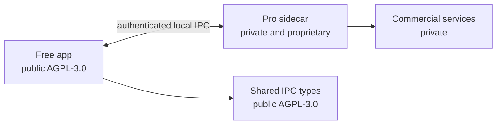

# Open-core model

WinCommander has a public Free edition and a closed-source Pro edition. This document is the authoritative public description of that boundary.

## Licence and source split

| Component | Source and licence | Use |
| :-- | :-- | :-- |
| Free app, frontend, shared IPC, and local keyword search | Public in this repository — [AGPL-3.0](LICENSE) | Read, modify, build, and redistribute under the AGPL. |
| Pro sidecar, advanced feature implementation, fleet services, investigator workflows, and commercial operations | Private and proprietary — [WinCommander EULA](https://servalabs.com/eula) | Requires a valid entitlement. Source is not public. |

Free is real open source in the OSI sense. You may fork, build, modify, and redistribute it under AGPL-3.0. Its copyleft obligations apply when you redistribute modified versions, including network-use cases covered by AGPL section 13.

Pro is not open source. It lives in a private repository and is governed by the EULA. A paid entitlement authorizes use of the Pro binary; it does not grant source access.

## Entitlement and feature boundary

The Free app and Pro sidecar form one desktop experience. Paid actions require a signed entitlement verified by the backend, then cross an authenticated local IPC boundary to Pro. A locked control in the UI is only a usability cue — it is never the authorization boundary.

Pro contains advanced safeguards, deep cleanup, evidence and vault workflows, enforcement features, fleet capabilities, and investigator workflows. The split also keeps Defender-sensitive implementation out of the Free binary. Free CI enforces that boundary with a blocking strings check.

New devices may start one 16-day full-feature trial per device. The licence service issues the signed token and enforces the one-trial limit. Portable builds have no trial and require a purchased key for Pro.

## Source review

ServaLabs may grant Pro source review by invitation to press, technology reviewers, and security researchers. Request access at [licensing@servalabs.com](mailto:licensing@servalabs.com). Report vulnerabilities through [SECURITY.md](SECURITY.md), not the licensing address.

## Forking Free

- You may build, use, modify, and redistribute Free under AGPL-3.0.
- You may not distribute Pro, bypass Pro entitlement checks, or offer Pro features as a service without a commercial agreement.
- If you need a commercial licence for Free-derived work, contact [licensing@servalabs.com](mailto:licensing@servalabs.com).

## Trademark and relicensing

The WinCommander name and logo are ServaLabs trademarks; AGPL-3.0 does not grant trademark rights. Contributors grant the rights described in [CLA.md](CLA.md), including ServaLabs's ability to license contributed work under future terms.
