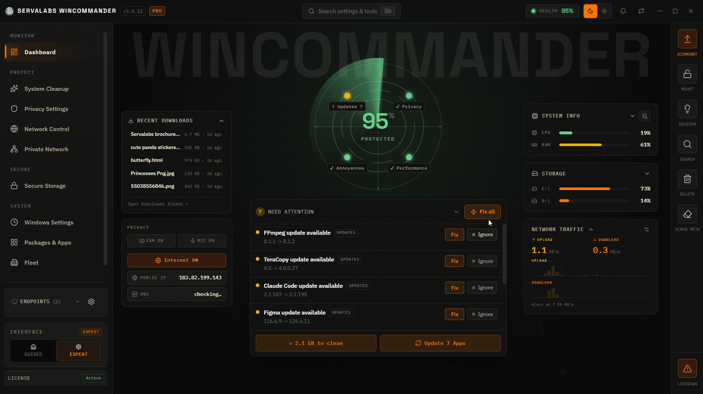

<div align="center">

# WinCommander

### Take back control of your Windows.

One command console to switch off Microsoft's tracking, block trackers on your network, erase your digital leftovers, and stand guard against ransomware — local-first, zero telemetry.

[](https://github.com/servalabs/wincommander/releases)
[](LICENSE)
[](https://github.com/servalabs/wincommander/releases)
[](SECURITY.md)

[**Download**](https://github.com/servalabs/wincommander/releases) · [Features](FEATURES.md) · [Security](SECURITY.md) · [Why it exists](POSITIONING.md)



</div>

## Why WinCommander

Windows scatters its privacy controls across ~150 settings panels, quietly keeps histories and caches about everything you do, and phones home by default. The usual fixes are either opaque "optimizer" apps you can't trust or loose scripts you can't reason about.

WinCommander is the third option: a single, open-source command console that shows you exactly how locked-down your PC is — and lets you fix it in clicks.

## Top features

- **Live privacy score** — one 0–100 number for how locked-down your PC is, with exactly what to fix next. Drift from your ideal state is detected continuously.
- **Kill Windows tracking** — the telemetry, ads, and data-collection settings Microsoft spreads across ~150 panels, all in one place.
- **Block trackers network-wide** — one-click blocklists for ads, telemetry, and known bad hosts.
- **Find any file instantly** — press `Ctrl+Space` anywhere for fast search across file names *and* file contents. The index never leaves your machine.
- **Erase your trail** — clear the histories, caches, and junk Windows quietly keeps about what you do.
- **Stand guard 24/7** — ransomware alerts, USB protection, clipboard watch, and a VPN kill-switch run in the background.
- **Emergency lockdown** — an opt-in panic sequence you can fire with a single hotkey (`Ctrl+Shift+Q`) when it matters most.

**No accounts. No cloud. Zero telemetry.** The app's only network calls are the update check and (if you buy Pro) license activation.

## Install

1. Download the latest installer from [Releases](https://github.com/servalabs/wincommander/releases).
2. Run it on Windows 11 (most features need Administrator).
3. Pick **Casual** or **Secure** in the first-run setup — that's it.

Or run from source:

```powershell
git clone https://github.com/servalabs/wincommander.git
cd wincommander
powershell -NoProfile -ExecutionPolicy Bypass -File .\tools\dev.ps1
```

`tools/dev.ps1` installs Bun 1.3.14 when absent, installs the exact Rust
toolchain/components pinned in `rust-toolchain.toml`, then starts Tauri. The
Visual Studio C++ Build Tools and Windows SDK remain manual prerequisites.

## Free vs Pro

Everything in this repo is free and open source. **Pro** is closed source and proprietary; it adds deeper cleanup, encrypted vaults, advanced monitors, and fleet management for teams. Full comparison: [FEATURES.md](FEATURES.md).

## Verify your download

Every release is built in public CI and verifiable end to end. The signed MSI,
updater manifest, signature, SBOM, and SHA-256 checksum are published together
on the GitHub Release:

- **Build provenance (SLSA)** — each installer carries a Sigstore-backed attestation tying it to the exact public commit and CI run that built it:

  ```powershell
  gh attestation verify ".\WinCommander_<version>_x64_en-US.msi" -R servalabs/wincommander
  ```

- **Dependency inventory** — every release includes a CycloneDX SBOM for offline vulnerability scanning.

## Learn more

| Doc                                | What's inside                                                 |
| :--------------------------------- | :------------------------------------------------------------ |
| [FEATURES.md](FEATURES.md)         | Every feature, exhaustively — Free and Pro                    |
| [ARCHITECTURE.md](ARCHITECTURE.md) | How it's built: two binaries, encrypted modules, IPC          |
| [SECURITY.md](SECURITY.md)         | Threat model, security posture, how to report a vulnerability |
| [docs/cli.md](docs/cli.md)         | Automate the same Free executable with JSON and safety gates   |
| [POSITIONING.md](POSITIONING.md)   | Who it's for and how it compares to alternatives              |
| [NON-GOALS.md](NON-GOALS.md)       | What WinCommander deliberately is not                         |
| [CONTRIBUTING.md](CONTRIBUTING.md) | How to contribute                                             |

## Licensing

- **WinCommander Free** (this repo) — [AGPL-3.0](LICENSE), free and open source.
- **WinCommander Pro** — proprietary, governed by the [WinCommander EULA](https://servalabs.com/eula).
- [Privacy Policy](https://servalabs.com/privacy)

## Security & source review

ServaLabs welcomes review of the Pro source code — press, technology reviewers, and security researchers can contact [licensing@servalabs.com](mailto:licensing@servalabs.com) for access. To report a vulnerability, see [SECURITY.md](SECURITY.md).
