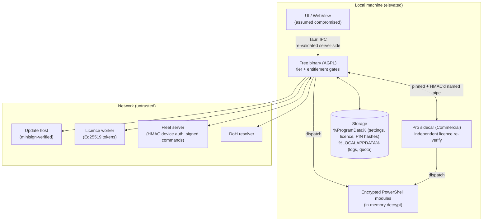

# Security — WinCommander

WinCommander is a privacy + security tool, so reports are triaged out-of-band from public issue tracking. This document is public-safe: no secrets, no live config, no exploit detail.

## Reporting a vulnerability

**Do not** open a public GitHub issue, PR, or Discussion. Email **security@servalabs.com** with:

- the affected component (Free app, Pro sidecar, licence worker, encrypted PowerShell modules, fleet server, updater),
- the version + build hash (Help → About),
- reproduction steps or a minimal PoC, and your impact assessment.

Response targets: acknowledgement within **72 hours**, triage decision within **7 days**, fix within **30 days** for critical issues (**90 days** for lower severity). Ask in your first email if you want credit in the release notes.

**Safe harbor.** Good-faith security research under this policy is **authorized** — we will not pursue or support legal action (including under the CFAA, the DMCA, or equivalent laws) against researchers who avoid privacy violations, data destruction, and degradation of service; access only the minimum data needed to demonstrate the issue; and give us reasonable time to remediate before public disclosure. If a third party brings legal action against good-faith research under this policy, we will make this authorization known. This is not a bug-bounty program, and it does not authorize testing other customers' deployments or ServaLabs production infrastructure without prior written permission.

**Pro source review** is available by invitation to press, technology reviewers, and security researchers — email **licensing@servalabs.com** (keep **security@servalabs.com** for vulnerability reports).

## Supported versions

| Version | Supported |
| :-- | :-- |
| Current minor (on `main`) | ✅ |
| Previous minor | ✅ (30 days after a new minor ships) |
| Older | ❌ |

Critical data-sanitization and licence-related fixes may ship as a forced update via the in-app updater to keep the install base on a safe baseline.

## Threat model

The WebView is assumed compromised, the AGPL Free binary and the proprietary Pro sidecar are separate processes bridged by a signed pipe, and every network host is treated as hostile.

**Trust boundaries — where untrusted input enters:**

- **WebView → backend (Tauri IPC).** The WebView is treated as compromised; every rule the UI implies is re-checked in Rust. Paid commands pass `require_paid`, tier and module gates run server-side — UI gating is cosmetic.
- **Free ↔ Pro (named pipe).** Cross-process boundary between the open Free binary and the proprietary Pro sidecar.
- **Fleet agent ↔ fleet server (HTTP).** Devices are untrusted callers (per-device HMAC auth); the server is equally untrusted by devices (all config and commands must verify against a key pinned at enrollment).
- **Network responses.** Updater manifests/artifacts, licence-worker responses, the Pro download, and DoH answers — hostile until verified.
- **Filesystem / clipboard input** consumed by the monitors, the search indexer, and the metadata scrubber.

**Assets protected:** the licence-entitlement gate, the encrypted PowerShell module loader, the Free↔Pro trust relationship, the updater signing chain, locally stored settings/licence/trial state, fleet org isolation and seat/last-admin invariants, and evidence-vault chain integrity.

**Out of scope:** issues requiring an attacker who already holds local Administrator (unless they cross a meaningful trust boundary such as the Pro sidecar or licence-cache integrity); self-inflicted misconfiguration; third-party-dependency issues that don't affect WinCommander's posture; and the intentionally aggressive data-sanitization surface. See [NON-GOALS.md](NON-GOALS.md).

## Security posture

**Licensing & entitlement**

- Paid features require an Ed25519-signed, device-bound licence token verified against a build-embedded public key. The UI gate is mirrored by a backend `require_paid` check, and the Pro sidecar independently re-verifies the licence before running any paid command — a patched Free binary cannot unlock Pro.
- The licence worker (Cloudflare + D1) verifies the signature on any presented token before refresh/deactivate; the signing key exists only in Cloudflare secrets, never in the repo or client.
- Startup-PIN hashes are Argon2id, keyed by a per-machine device hash — an off-disk read of the settings file can't brute-force a short PIN.

**Free ↔ Pro IPC**

- Per-spawn random named pipe with SHA-256 binary pinning at handshake; a fresh 32-byte CSPRNG session token per spawn; every frame HMAC-SHA256-signed and verified in constant time; 16 MiB frame cap. Replays from a prior session fail against the rotated key.

**Assumed-compromised WebView**

- PowerShell dispatch never builds command strings from frontend data — the command name and parameters travel out-of-band via environment variables and are hydrated as data, not code. Blocking CI gates enforce this.
- Destructive commands are enumerated in a Rust registry and require a single-use, args-bound authorization capability minted only by a Rust-verified PIN, native dialog, or real duress trigger. Filesystem-destructive paths are canonicalized and confined against `..`/symlink traversal.

**Data handling**

- **Zero telemetry.** Outbound traffic is limited to update checks, licence activation/refresh (paid only), fallback DoH, and — only when fleet-enrolled — check-ins to the operator's own server.
- Machine-wide state lives under `%ProgramData%\WinCommander\`, per-user logs and quota under `%LOCALAPPDATA%`; all writes are atomic temp-then-rename.
- The full-text search index is ACL-restricted to the owning user; indexed files are treated as untrusted input (parser advisories tracked, decompression caps against zip bombs).
- Monitor events cross the IPC boundary as matched-pattern labels only — never the clipboard or file contents that triggered them.

**Code execution surface**

- PowerShell modules are AES-256-GCM-encrypted at build time and decrypted only in memory — never plaintext on disk.
- Security-reducing logic (Defender/UAC/VBS/SmartScreen disable and similar) is physically absent from the Free build and runs only in the licence-gated Pro sidecar. A blocking CI strings-scan fails the merge if a forbidden command token appears in the Free binary.

**Updater & network hardening**

- Update manifests and artifacts are minisign-verified; the Pro download host is pinned in Rust (frontend-supplied hosts/hashes are rejected).
- The WebView CSP has no `unsafe-inline`/`unsafe-eval` and allow-lists only the update, licence, and operator fleet hosts on `connect-src`.

**Argus monitoring (Pro, consent-gated)**

- Every monitor sits behind a deny-by-default consent gate and stops without a valid, current, non-revoked consent record.
- **Privacy invariant:** window titles, exe paths, URLs, filenames, and usernames are used only to compute local aggregate scalars — what leaves the device is kind/class/magnitude/severity signals with no names or paths. The fleet server rejects (403) Argus payloads whose consent version doesn't match the current disclosure version.

**Fleet**

- Devices authenticate every device-plane request with a per-device HMAC secret. HMAC v2 binds the method, exact route path, and complete canonical JSON payload (excluding only `hmac`), in addition to timestamp-window and nonce-replay defences; the server stores the secret KEK-encrypted and persists a one-way v2 floor after first successful use. Each secret validates only its own device — there is no cross-device token to reuse.
- Agents verify every config epoch and command against an Ed25519 key pinned at enrollment, with monotonic anti-rollback — a rogue or DNS-hijacked server can withhold commands but never forge them. Re-enrollment never silently re-pins to a new key.
- Admin routes re-read role and org membership from the store on every request; last-super-admin and seat-cap invariants are enforced atomically under concurrency; admin login throttles with escalating lockout; passwords are Argon2id.
- Optional TLS public-key pinning (with rotation overlap) and check-in traffic shaping (randomized timing, padded sizes, cover traffic) resist on-path fingerprinting. Missed check-ins fail toward "assume compromised" — never silently skipped.
- Fleet enrollment commands are entitlement-gated (`require_paid`); an unlicensed install cannot enroll regardless of UI or settings state.

**Evidence vault (Pro)**

- Exports are SHA-256 hash-chained and Ed25519-signed over a canonical manifest; verification re-walks the chain and detects any edit, reorder, truncation, or signature flip. Verification is deliberately ungated (Free can verify a bundle); export requires a licence. Optional RFC-3161 timestamping and TPM co-sign.

**Destructive operations & secure erase**

- Operations that claim to remove data must verify the removal — each reports found-vs-removed, failures propagate as structured failures, and partial results surface as partial, never as overall success.
- Overwrite-based clearing is treated as best-effort on flash media (SSD/NVMe/eMMC), per NIST SP 800-88 Rev.2 / IEEE 2883. The destruct pipeline runs cryptographic erase (key destruction) first so the guarantee lands even if a later step is interrupted; firmware sanitize results are graded **exact** vs **degraded**, and every run emits a certificate (Ed25519-signed when a device key is present, explicitly marked unsigned otherwise).
- A read-only hardware capability probe reports what erase paths each drive supports — detection only, no destructive commands.
- BitLocker crypto-erase reports a non-empty `escrow_warning` when an escrowed recovery key may still exist; callers must treat that as an incomplete erase.

**Supply chain**

- Lockfiles frozen in CI; dependency audit + Gitleaks run in CI; the Rust toolchain is pinned. Release binaries embed their dependency tree (`cargo auditable`) and ship a CycloneDX SBOM with SLSA provenance — see [Verify your download](README.md#verify-your-download).

## Hardening notes (for operators)

- Install only the ServaLabs-signed MSI from the official updater channel; obtain Pro only via the in-app install flow (pinned host, verified hash).
- Keep auto-update enabled — forced security updates rely on it. Dev builds skip update checks entirely (compile-time guard).
- Several operations are intentionally irreversible (secure shred, privacy-clean erases, self-destruct); they show explicit warnings and countdowns — treat them as one-way.
- **Fleet:** set the server signing key before first start; enroll devices via the in-app "Enroll this device" flow so the entitlement check, settings persistence, and key pinning all run through the gated path. Rotating the signing key requires re-enrolling devices.
- **Argus:** review consent records and version coupling after any disclosure policy change.
- **Secure erase:** treat overwrite-based clearing on flash drives as trace reduction, not a guarantee; prefer crypto-erase where a guarantee is required. A **degraded** grade on an erasure certificate means only an overwrite fallback ran — physically destroy the drive if the data was sensitive.
- Build keys (updater minisign, licence Ed25519, fleet signing key, R2 credentials) belong only in CI/build secrets. If a secret is ever committed, email security@servalabs.com so it can be rotated.

## Scope

**In scope:** the Free binary; the Pro sidecar boundary (IPC handshake, transport, replay resistance, encrypted module loader); the licence worker; the fleet server and agent (device auth, org isolation, seat/admin invariants, command signing); Argus consent and privacy invariants; the evidence-vault signing chain; the auto-updater chain; the destructive-operation result-reporting path; and the secure-erase pipeline (capability probe + USB destruct).

**Reports we prioritize:** licence-gate bypass; running attacker-supplied scripts through the module loader; forging entitlements, fleet commands, or evidence-vault bundles; cross-device or cross-org fleet access; PII escaping the Argus privacy invariant; session-token replay between Pro spawns; updater-chain compromise; a clear/cleanup operation reporting success without verifying removal; and a destructive erase run without a valid device-bound authorization.
