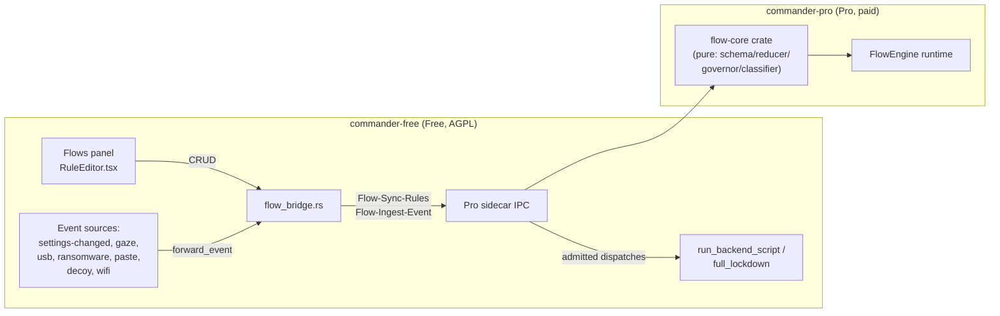
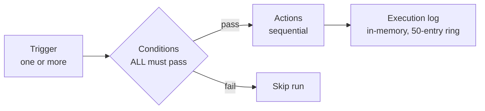

# Flows automation engine

WinCommander ships **two** flow engines side by side. **Flows v2** (`app.proFlows`, paid) is
the current, actively developed automation surface — a Pro-backed "when this happens, do that"
rule engine with a pure, unit-tested core. The **legacy engine** (`app.flows`, free) still runs
the four pre-seeded system flows (contingency signal, panic hotkey, lid-guard, USB-guard) and is
otherwise superseded — see [§ Legacy engine](#legacy-engine-pre-seeded-system-flows-only).

If you're looking for the old React Flow visual node-canvas: it's gone. `src/types/flows.ts`
was deleted in the 2026-07 rewrite; the current panel (`src/panels/flows/`) is a list + form
editor (`RuleEditor.tsx`) over the `flow_bridge` Tauri commands, not a graph canvas.

## Flows v2 (Pro-backed, current)

Rules are authored in the **Flows** panel, persisted to `settings.app.proFlows` (a raw JSON
array of the Pro `flow-core::Rule` wire shape — deliberately **separate** from the legacy
`app.flows` store so the two engines never double-execute the same trigger), and evaluated by
the Pro sidecar's `FlowEngine`. Every v2 command is gated on `license::require_paid("flows")`.

**Division of labor:** Free never decides which rule fires. It (1) persists the rule set and
re-syncs the whole thing to Pro on every CRUD change (`Flow-Sync-Rules`), (2) normalizes each
observed event plus a read-only world snapshot and hands them to Pro (`Flow-Ingest-Event`), and
(3) executes whatever dispatches Pro admits, through the **same gate chain the UI uses**
(`run_backend_script` — tier/module/evidence-integrity-kill-switch — or `full_lockdown` for the one
`Lockdown` action type, which independently re-verifies `self_destruct.enabled`). The engine
itself — trigger matching, debounce, re-entrancy, loop detection, and the action safety
classifier — runs in Pro (`flow-core` crate + `commander-pro/src/flow/`).

### Trigger vocabulary

Same 14 usable trigger types as the legacy engine (Hotkey, KeySequence, USB, LidClose, Webhook,
Schedule, Network, File, Process, SignalReceived, PasteMonitor, DecoyMonitor,
RansomwareMonitor, WifiGuard) retargeted onto the shared v2 event pipeline, plus two new ones
the legacy engine never had:

| Trigger | What it fires on |
| :-- | :-- |
| `SettingChangedTrigger` | A settings JSON path transitions (optionally to a specific value). Backed by a diff emitted at the single settings write choke point (`write_settings_internal`); DECOY_MODE-gated (nothing emits during a coerced session). Makes "telemetry turned on → location off"-style rules possible — the legacy engine could only gate on a setting, never trigger from one. |
| `GazeTrigger` | Privacy Shield's gaze/attention detector fires `look_away` / `no_face` / `multiple_faces` / `secondary_device`. Replaces the legacy engine's dead `CameraTrigger` (which had no producer and was permanently `Disabled`) — the gaze event is now real, wired from Pro's `attention_collector::handle_episode_line` through `send_notification("privacy-shield-event", {kind})`. |

The editor discovers scalar and array leaves from the live settings tree instead of limiting
rules to a small hard-coded preset list. Trigger and `Setting` condition fields are searchable
and also accept a custom dot path. Secret-bearing paths (PINs, hashes, seeds, passwords,
phrases, tokens, private keys), stored flow payloads, contingency configuration, and
high-frequency internal bookkeeping paths are excluded from suggestions. A setting trigger can
match any transition or one exact JSON value; setting conditions expose `==` and `!=`.

The legacy trigger vocabulary's `CameraTrigger` survives in the v2 schema only as a
deserialize-only legacy variant — an old `settings.json` with a rule using it loads without
erroring, but the rule is disabled on migration, never executed.

### Condition & action vocabulary

Conditions: `Time`, `Setting`, `Network`, `Battery`, `UsbPresence` — same set as legacy,
AND-only semantics (all conditions must pass), evaluated against a **read-only world snapshot**
(the settings tree + current time), never disk — the reducer is pure and unit-tested with
synthetic clocks.

Actions are **in-app commands only** — no raw-PowerShell action and no arbitrary-URL action
exist in v2 (both were the legacy engine's biggest safety hole; see
[§ Legacy engine](#legacy-engine-pre-seeded-system-flows-only)):

| Action | Behavior |
| :-- | :-- |
| `RunCommand` / `SetToggle` | Resolves to a backend command name, dispatched through `run_backend_script` (inherits tier/module gates). `SetToggle` is sugar that resolves a toggle id to its enable/disable command. The Pro classifier already verified the resolved command exists in the live command catalog before Free ever sees it — an unrecognized command is `Denied` at classify time, not at execution time. |
| `Signal` | `Send-ContingencySignal` to mesh peers. |
| `Notify` | Toast on this machine. |
| `Delay` | Sleep between actions (capped at 600s). |
| `Lockdown` | The **only** safe entry point: `backend::full_lockdown`, which independently re-verifies `settings.ideal.privacy.self_destruct.enabled` and refuses if not armed. Never inlined — a new action type must never bypass this chokepoint. |
| `Parallel` | Runs nested actions concurrently; depth-capped. |

Destructive commands (shred, Deep Clean, etc.) **are allowed** as `RunCommand` targets — the
classifier's job is only to confirm the action is a recognized in-app command; the command's own
tier/module/irreversibility gates still apply downstream. This was a deliberate 2026-07-05 owner
decision, not an oversight.

### Storage & commands

Rules live in `settings.app.proFlows[]` — separate from the legacy `app.flows[]` specifically so
neither engine's listeners can double-fire the same trigger. `flow_bridge.rs` exposes:

| Command | Purpose |
| :-- | :-- |
| `flow_list_rules` | List the raw rule JSON. |
| `flow_save_rule` | Create/update by `id`; persists then re-syncs the whole set to Pro. Refuses if the rule is fleet-locked or the device is policy-locked (`app.flows`/`app.proFlows` in `locked_paths`). |
| `flow_delete_rule` | Delete by id; same fleet/policy-lock refusal. |
| `flow_set_enabled` | Toggle a rule on/off; same refusal. |
| `flow_fire_now` | Manual test trigger — currently just re-syncs to Pro and emits a UI acknowledgement event (`flow-fired-manually`); real per-rule manual dispatch through the Pro engine is a follow-up, not yet wired. |

There is **no** `get_flow_executions` equivalent for v2 — unlike the legacy engine's in-memory
Rust-side 50-run ring buffer, v2's "execution log" is purely a frontend `useState` array
(`useFlowsV2.ts`, capped, newest-first) populated live from `flow-executed`/`flow-log` Tauri
events. Closing the Flows panel or restarting the app loses it entirely; there is no backend
buffer to re-fetch from. This is a step down from the legacy engine's (already non-durable, but
at least re-fetchable) ring buffer — a durable or backend-buffered log is not yet built for v2.

### Fleet distribution

A managed device's admin can lock the rule set: `flows_locked_by_policy()` checks
`policy.sync_mode == "managed"` and `app.flows`/`app.proFlows` in `policy.locked_paths`, and
every mutating v2 command refuses if locked. Individual rules can also carry `locked: true`
(fleet-pushed), which every CRUD path refuses to edit or delete locally regardless of the
device-wide lock — a deterrent on the client side; the server-side `locked_paths` check is the
real enforcement point.

## Legacy engine (pre-seeded system flows only)

The original n8n-style engine (`flow_engine.rs`, 3,965 lines, no unit tests) still runs — it
owns `settings.app.flows[]` and the four built-in system flows below. It is not the surface for
new user automations (that's Flows v2, above); it is kept alive because those four flows are
load-bearing triggers (contingency/panic/lid-guard/USB-guard) and migrating them was out of
scope for the v2 rewrite.

### Pre-seeded system flows

Defined in `default_system_flows()` in `flow_engine.rs`. **Editable but not deletable** —
`delete_flow` rejects a system flow.

| ID | Trigger | Actions | Default enabled |
| :-- | :-- | :-- | :-- |
| `contingency` | F12 ×3 within 1s | Signal admins → `Disconnect-AllRDPSessions` → `Start-ContingencySequence` | yes |
| `panic-hotkey` | Ctrl+Shift+Q | Same as `contingency` | yes |
| `lid-guard` | Lid close | `Disconnect-AllRDPSessions` → signal admins | no |
| `usb-guard` | USB key removed | Same as `lid-guard` | no |

### Shared services

Listeners subscribe to one shared service per resource rather than each opening their own OS
hook or watcher:

| Service | File | Role |
| :-- | :-- | :-- |
| Keyboard hook | `services/keyboard_hook.rs` | One `WH_KEYBOARD_LL` low-level hook with subscriber fan-out (`KeySequenceTrigger`, lockdown phrase matching). Focus-independent — a triple-tap F12 fires whether or not WinCommander has focus, and bypasses the Chromium WebView (which would otherwise eat F12 as a DevTools shortcut). |
| Filesystem watcher | `services/fs_watcher.rs` | One `notify` (`ReadDirectoryChangesW`) watcher per `(path, recursive)` tuple (`FileTrigger`, decoy monitor, ransomware monitor). |
| Webhook server | `services/webhook_server.rs` | One `hyper` HTTP/1.1 server, bound to the mesh-VPN interface only (discovered via `tailscale.exe ip --4`), HMAC-SHA256 authenticated, refuses to fall back to `0.0.0.0` (load-bearing security invariant), refuses to start if the mesh VPN isn't running. Bodies capped at 64 KiB; every request must carry `X-Wincmd-Signature = HMAC-SHA256(secret, body)`. |

### Legacy commands (the IPC reference has the full table)

`get_flows`, `save_flow`, `delete_flow`, `toggle_flow`, `fire_flow` (supports `dryRun`),
`get_flow_executions`, `reload_flows`, `preflight_validate_flow`, `export_flow_bundle` /
`verify_flow_bundle` / `import_flow_bundle` (Ed25519-signed), `probe_flow_capabilities`,
`get_flow_health`. See [IPC reference § Flow engine](../engineering/ipc.md#flow-engine) for the full
command/return-type table.

### Legacy engine limitations (still true — carried over verbatim)

- **`CameraTrigger` was never usable in the legacy engine** — hard-rejected by `validate_flow`,
  hidden from the palette, capability probe hardcoded `Fail`. Superseded by v2's real
  `GazeTrigger` (above), not fixed in the legacy engine itself.
- **Execution log is not durable** — the in-memory ring of 50 runs is lost on restart.
- **No debounce on destructive flows** — concurrent fires of the same `flow_id` can race; a
  triple-tap F12 that registers ambiguously could spawn overlapping contingency cascades. (v2's
  governor fixes this with debounce + re-entrancy + loop-guard — another reason new automations
  belong in v2, not the legacy engine.)
- **Action sequencing stops on first failure** — no rollback, no "continue on failure."
- **`ShellAction` is unsandboxed** — runs whatever PowerShell you write with your full user
  privileges, no gate chain. **`HTTPAction`** is an arbitrary-URL HTTP request — no allowlist.
  Both exist only in the legacy engine and only for backward-compat with existing
  `settings.app.flows[]` entries; neither exists in v2's action vocabulary at all — v2's schema
  keeps them as deserialize-only legacy variants that `migrate()` disables on load rather than
  ever executing.
- **`SignalReceivedTrigger` is a brittle directory poll** — it polls the Pvt Mesh (Tailscale)
  Taildrop inbox (`%LOCALAPPDATA%\Tailscale\Taildrop`) for arriving `wc-signal-*.json` contingency
  files instead of subscribing to a filesystem event, so it silently breaks if the VPN relocates
  its Taildrop directory. Migration to the shared `services::fs_watcher` is pending
  (`flow_engine.rs:937`, watcher at `flow_engine.rs:2286`).

## Accuracy notes for product copy

Claims that would be **false** today:

- "Every trigger in the type system is production-ready" — the legacy engine's `CameraTrigger`
  is permanently disabled (use v2's `GazeTrigger` instead).
- "Durable, restart-safe execution history" — true of neither engine. The legacy engine has an
  in-memory 50-run ring (lost on restart, but readable via `get_flow_executions` while the
  process is up); v2 has no backend log at all — only an ephemeral frontend event stream.
- "Fully sandboxed action execution" — the legacy engine's `ShellAction` runs unsandboxed
  PowerShell with full user privileges. v2 has no shell-execution action type, so this claim is
  true for v2 specifically, false for the legacy engine.
- "Flows can run arbitrary PowerShell or hit any URL" — true only of the legacy engine's
  `ShellAction`/`HTTPAction`; both are absent from v2's action vocabulary by design.

This document describes shipped flow behaviour. Some advanced actions target
restricted capabilities that run in the Pro sidecar — see
[OPEN_CORE.md](../../OPEN_CORE.md).
