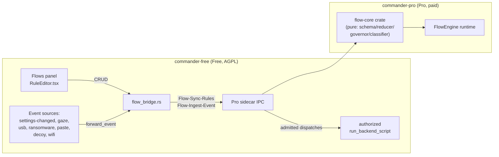
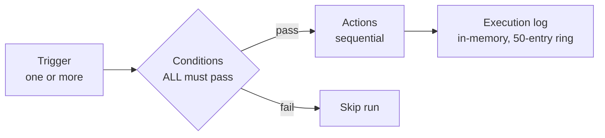

# Flows automation engine

WinCommander ships **two** flow engines side by side. **Flows v2** (`app.proFlows`, paid) is
the current, actively developed automation surface — a Pro-backed "when this happens, do that"
rule engine with a pure, unit-tested core. The **legacy engine** (`app.flows`, free) still runs
the four pre-seeded system flows (contingency signal, panic hotkey, lid-guard, USB-guard) and is
otherwise superseded — see [§ Legacy engine](#legacy-engine-pre-seeded-system-flows-only).

If you're looking for the old React Flow visual node-canvas: it's gone. `src/types/flows.ts`
was deleted in the 2026-07 rewrite; the current panel (`src/panels/flows/`) is a list + form
editor (`RuleEditor.tsx`) over the `flow_bridge` Tauri commands, not a graph canvas.

## Flows v2 (Pro-backed, current)

Rules are authored in the **Flows** panel, persisted to `settings.app.proFlows` (a raw JSON
array of the Pro `flow-core::Rule` wire shape — deliberately **separate** from the legacy
`app.flows` store so the two engines never double-execute the same trigger), and evaluated by
the Pro sidecar's `FlowEngine`. Every v2 command is gated on `license::require_paid("flows")`.

**Division of labor:** Free never decides which rule fires. It (1) persists the rule set and
re-syncs the whole thing to Pro on every CRUD change (`Flow-Sync-Rules`), (2) normalizes each
observed event plus a read-only world snapshot and hands them to Pro (`Flow-Ingest-Event`), and
(3) executes whatever non-destructive dispatches Pro admits through `run_backend_script`, which
still applies tier, module, and authorization gates. Persisted flows cannot answer a native
confirmation or hold an argument-bound, single-use destructive capability, so Lockdown and
protected erase dispatches fail closed. The engine
itself — trigger matching, debounce, re-entrancy, loop detection, and the action safety
classifier — runs in Pro (`flow-core` crate + `commander-pro/src/flow/`).

### Trigger vocabulary

Same 14 usable trigger types as the legacy engine (Hotkey, KeySequence, USB, LidClose, Webhook,
Schedule, Network, File, Process, SignalReceived, PasteMonitor, DecoyMonitor,
RansomwareMonitor, WifiGuard) retargeted onto the shared v2 event pipeline, plus two new ones
the legacy engine never had:

| Trigger | What it fires on |
| :-- | :-- |
| `SettingChangedTrigger` | A settings JSON path transitions (optionally to a specific value). Backed by a diff emitted at the single settings write choke point (`write_settings_internal`); DECOY_MODE-gated (nothing emits during a coerced session). Makes "telemetry turned on → location off"-style rules possible — the legacy engine could only gate on a setting, never trigger from one. |
| `GazeTrigger` | Privacy Shield's gaze/attention detector fires `look_away` / `no_face` / `multiple_faces` / `secondary_device`; the event is wired from Pro's `attention_collector::handle_episode_line` through `send_notification("privacy-shield-event", {kind})`. |

The editor discovers scalar and array leaves from the live settings tree instead of limiting
rules to a small hard-coded preset list. Trigger and `Setting` condition fields are searchable
and also accept a custom dot path. Secret-bearing paths (PINs, hashes, seeds, passwords,
phrases, tokens, private keys), stored flow payloads, contingency configuration, and
high-frequency internal bookkeeping paths are excluded from suggestions. A setting trigger can
match any transition or one exact JSON value; setting conditions expose `==` and `!=`.

Legacy-trigger compatibility is deserialize-only; current limitations are in
"Legacy commands and limitations" below.

### Condition & action vocabulary

Conditions: `Time`, `Setting`, `Network`, `Battery`, `UsbPresence` — same set as legacy,
AND-only semantics (all conditions must pass), evaluated against a **read-only world snapshot**
(the settings tree + current time), never disk — the reducer is pure and unit-tested with
synthetic clocks.

Actions are **in-app commands only** — no raw-PowerShell action and no arbitrary-URL action
exist in v2 (both were the legacy engine's biggest safety hole; see
[§ Legacy engine](#legacy-engine-pre-seeded-system-flows-only)):

| Action | Behavior |
| :-- | :-- |
| `RunCommand` / `SetToggle` | Resolves to a backend command name, dispatched through `run_backend_script` (inherits tier/module gates). `SetToggle` is sugar that resolves a toggle id to its enable/disable command. The Pro classifier already verified the resolved command exists in the live command catalog before Free ever sees it — an unrecognized command is `Denied` at classify time, not at execution time. |
| `Signal` | `Send-ContingencySignal` to mesh peers. |
| `Notify` | Toast on this machine. |
| `Delay` | Sleep between actions (capped at 600s). |
| `Lockdown` | Deserialize-only for existing rules. Persisted execution is refused because a background flow cannot provide the native, human-approved destructive capability. Interactive Lockdown and trusted Rust-owned triggers use separate authorized paths. |
| `Parallel` | Runs nested actions concurrently; depth-capped. |

Recognized commands can be stored as `RunCommand` targets, but execution still passes through the
command's own tier, module, and authorization gates. Commands requiring an interactive,
argument-bound destructive capability are refused when invoked by a persisted flow.

### Storage & commands

Rules live in `settings.app.proFlows[]` — separate from the legacy `app.flows[]` specifically so
neither engine's listeners can double-fire the same trigger. The authoritative
flow command catalog is in the [IPC reference](../engineering/ipc.md); current
automation limitations are in "Legacy commands and limitations" below.

### Fleet distribution

A managed device's admin can lock the rule set: `flows_locked_by_policy()` checks
`policy.sync_mode == "managed"` and `app.flows`/`app.proFlows` in `policy.locked_paths`, and
every mutating v2 command refuses if locked. Individual rules can also carry `locked: true`
(fleet-pushed), which every CRUD path refuses to edit or delete locally regardless of the
device-wide lock — a deterrent on the client side; the server-side `locked_paths` check is the
real enforcement point.

## Legacy engine (pre-seeded system flows only)

The original n8n-style engine (`flow_engine.rs`, 3,965 lines, no unit tests) still runs — it
owns `settings.app.flows[]` and the four built-in system flows below. It is not the surface for
new user automations (that's Flows v2, above); it is kept alive because those four flows are
load-bearing triggers (contingency/panic/lid-guard/USB-guard) and migrating them was out of
scope for the v2 rewrite.

### Pre-seeded system flows

Defined in `default_system_flows()` in `flow_engine.rs`. **Editable but not deletable** —
`delete_flow` rejects a system flow.

| ID | Trigger | Actions | Default enabled |
| :-- | :-- | :-- | :-- |
| `contingency` | F12 ×3 within 1s | Signal admins → `Disconnect-AllRDPSessions` → `Start-ContingencySequence` | yes |
| `panic-hotkey` | Ctrl+Shift+Q | Same as `contingency` | yes |
| `lid-guard` | Lid close | `Disconnect-AllRDPSessions` → signal admins | no |
| `usb-guard` | USB key removed | Same as `lid-guard` | no |

### Shared services

Listeners subscribe to one shared service per resource rather than each opening their own OS
hook or watcher:

| Service | File | Role |
| :-- | :-- | :-- |
| Keyboard hook | `services/keyboard_hook.rs` | One `WH_KEYBOARD_LL` low-level hook with subscriber fan-out (`KeySequenceTrigger`, lockdown phrase matching). Focus-independent — a triple-tap F12 fires whether or not WinCommander has focus, and bypasses the Chromium WebView (which would otherwise eat F12 as a DevTools shortcut). |
| Filesystem watcher | `services/fs_watcher.rs` | One `notify` (`ReadDirectoryChangesW`) watcher per `(path, recursive)` tuple (`FileTrigger`, decoy monitor, ransomware monitor). |
| Webhook server | `services/webhook_server.rs` | One `hyper` HTTP/1.1 server, bound to the mesh-VPN interface only (discovered via `tailscale.exe ip --4`), HMAC-SHA256 authenticated, refuses to fall back to `0.0.0.0` (load-bearing security invariant), refuses to start if the mesh VPN isn't running. Bodies capped at 64 KiB; every request must carry `X-Wincmd-Signature = HMAC-SHA256(secret, body)`. |

### Legacy commands and limitations

The [IPC reference](../engineering/ipc.md) owns the legacy command catalog.
This document owns the engine's current limitations.

- The v2 manual-test bridge re-syncs rules and reports an acknowledgement; it
  does not dispatch an individual rule. Its execution log is a capped,
  frontend-only event stream, lost when the panel closes or the app restarts.
- `LockdownAction` remains deserialize-only for existing rules and is not offered
  for new rules. Existing instances fail closed until replaced. Protected erase
  commands likewise cannot run unattended from a persisted flow.
- The legacy `CameraTrigger` is permanently disabled. Use the v2 `GazeTrigger`.
- Legacy execution history is an in-memory 50-run ring and is lost on restart.
  Destructive legacy flows have no debounce, actions stop at the first failure,
  and there is no rollback or continue-on-failure behavior.
- Legacy `ShellAction` runs unrestricted PowerShell and legacy `HTTPAction` can
  reach an arbitrary URL. Both execute only in the legacy engine for backward
  compatibility; v2 treats them as deserialize-only variants and disables them
  during migration rather than executing them.
- Legacy `SignalReceivedTrigger` polls the Taildrop inbox and can break if the
  VPN relocates that directory. Migration to the shared filesystem watcher is
  pending.

This document describes shipped flow behaviour. Some advanced actions target
restricted capabilities that run in the Pro sidecar — see
[OPEN_CORE.md](../../OPEN_CORE.md).
