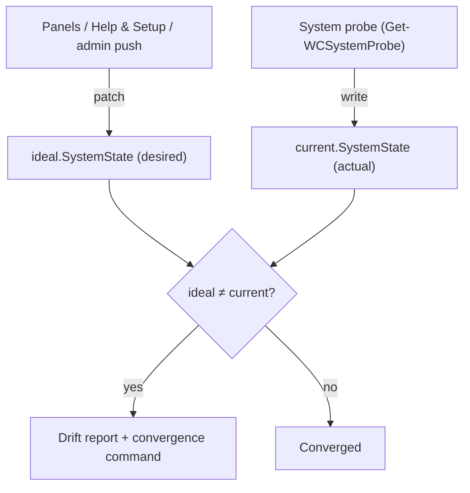

# Settings reference

A single reference for how WinCommander models and stores settings, the full
settings tree by category, and the toggle/command catalog that maps each UI
switch to its backend commands.

This document is descriptive. The authoritative, machine-checkable definitions
live in code:

- [`src/types/settings.ts`](../src/types/settings.ts) — the TypeScript schema (mirror of the Rust struct).
- [`src-tauri/commander-free/src/settings.rs`](../src-tauri/commander-free/src/settings.rs) — the Rust `AppSettings` engine (schema, migration, drift, convergence).
- [`src/registry/*.toggles.ts`](../src/registry/) — the per-toggle registry (UI label, backend commands, scores, radar, setup) — the single source of truth for every toggle.

When this doc and the code disagree, the code wins.

## The desired-state model: ideal vs current

Settings are version 2 of the schema and use an **ideal / current** dual model.
Each side holds a full `SystemState` (privacy, tweaks, network, identity, apps,
productivity, server apps, security). The difference between them is *drift*.

| Section   | Meaning                                | Who writes it                                            | When                                          |
|-----------|----------------------------------------|---------------------------------------------------------|-----------------------------------------------|
| `ideal`   | What the admin/user **wants**          | UI toggles, admin push, migration, Help & Setup         | On a user action or an admin config push      |
| `current` | What the OS **actually reports**       | the system probe (auto-probe)                           | Every startup, and after toggle commands run  |

- **First run:** the probe populates **both** `ideal` and `current`; migration then overlays `ideal` only.
- **Subsequent runs:** the probe updates **`current` only**, so drift is defined as `ideal ≠ current`.



After a successful toggle, the backend syncs the new state back into **both**
`ideal` and `current` via a command→settings mapping, so the UI reflects the
change immediately without waiting for the next probe.

### Drift detection and convergence

The Rust engine flattens `ideal` and `current`, compares them, and emits a
report. Each drift item carries the settings path, both values, and (where a
reverse mapping exists) the PowerShell command that would fix it.

```typescript
interface DriftItem {
  path: string;            // e.g. "privacy.telemetry.windowsDisabled"
  idealValue: unknown;
  currentValue: unknown;
  command: string | null;  // PS command to converge, or null if none
}
```

Convergence commands are mapped for settings paths across all categories
(privacy, tweaks, security, OS, UI, boot/kernel, apps, productivity). When the
optional `autoHeal` preference is on, detected drift is re-applied
automatically after each probe; irreversible and action-type toggles are never
auto-healed.

## Where settings live

Settings are persisted **machine-wide** under `%ProgramData%`, not per-user, so
every Windows account on the device shares one configuration (the app runs
elevated). Persistence goes through the app-data store
([`datastore.rs`](../src-tauri/commander-free/src/datastore.rs)), which encodes
each section at rest:

- **Store files:** `%ProgramData%\<APP>\store\<section>.dat`. Settings are the `settings` section.
- **At-rest format:** `enc:v1:` + base64(`nonce[12]` ‖ ciphertext-with-GCM-tag), encrypted with **AES-256-GCM**.
- **Key derivation:** a per-install 32-byte material file (`%ProgramData%\<APP>\.install.material`) is the Argon2id salt. General sections derive their key from an empty password; the private section derives from a user passphrase. The material is generated once and is **not** tied to the binary version, so settings survive app updates.

A wrong passphrase on the private section yields an AES-256-GCM authentication
failure — there is no plaintext fallback.

### Legacy migration

Earlier builds stored a plaintext `%APPDATA%\WinCommander\settings.json`. On
first run with the encoded store, that legacy file is read, migrated into the
store, and deleted. Schema versions below the current version are migrated on
load.

### Caching and writes

The engine keeps a `Mutex`-guarded in-memory cache. All writers funnel through a
single internal write path (atomic write to the store). While a decoy session is
active, that write path refuses every write, so a coerced decoy session can
never persist over — or erase — the real configuration.

## Root schema (v2)

The top-level shape, from [`src/types/settings.ts`](../src/types/settings.ts):

```json
{
  "settingsVersion": 2,
  "appVersion": "…",
  "deviceId": "uuid-v4",
  "lastSeenAt": "ISO-8601 UTC",
  "createdAt": "ISO-8601 UTC",

  "app":     { "…AppPreferences…" },
  "ideal":   { "…SystemState…" },
  "current": { "…SystemState…" },
  "policy":  { "…PolicySettings…" }
}
```

| Top-level key | Type            | Purpose                                                        |
|---------------|-----------------|---------------------------------------------------------------|
| `app`         | `AppPreferences`| Application preferences (theme, first-run, hotkeys, UI state, flows, contingency, file search, etc.). |
| `ideal`       | `SystemState`   | Desired system state (what the user/admin wants).             |
| `current`     | `SystemState`   | Probed system state (what the OS reports).                    |
| `policy`      | `PolicySettings`| Admin/fleet sync mode, locked paths, organization, master config version. |

### SystemState shape

Both `ideal` and `current` hold this shape:

| Category       | Field         | Notes                                                                 |
|----------------|---------------|----------------------------------------------------------------------|
| Device         | `device`      | Hardware/OS identifiers, disks, users, BitLocker, GPU/CUDA detection. |
| Privacy        | `privacy`     | Telemetry, clipboard, tracking, lock screen, app capabilities, internet-communication, Privacy Shield, monitors (decoy/ransomware/remote-access/screen-capture), panic triggers, self-destruct, activity reduction. |
| Tweaks         | `tweaks`      | Security, OS, UI, boot/kernel, performance, GPU, power, RDP, power plan. |
| Network        | `network`     | DNS, hosts blocklists, firewall, VPN kill switch.                    |
| Identity       | `identity`    | Branding, stealth/quiet mode, panel visibility flags.               |
| Apps           | `apps`        | Required/blocked apps, removals, inventory snapshot (in `current`).  |
| Productivity   | `productivity`| Tracker enable, AFK exclusion, default range.                        |
| Server apps    | `serverApps`  | Self-hosted app definitions (URL, icon, CSS injection).             |
| Security       | `security`    | Driver-health / Device-Manager diagnostics.                         |

> The `apps.inventory` snapshot is only meaningful inside `current` — it holds
> the persisted app scan. Drift compares `ideal.apps.requiredApps` against
> `current.apps.inventory.manifestApps`.

### App preferences (`app`)

`AppPreferences` holds device-local UI and behavior preferences that are *not*
part of system state. Notable groups (see the struct for the complete list):

- **Display/UX:** `theme`, `experienceLevel`, `density`, `sidebarCollapsed`, `lastPanel`, `dashboardViewMode`, `dashboardOpenCards`.
  - `dashboardViewMode` persists the requested Home center view (`map`, `risk`, or `products`), but the frontend resolves an `effectiveViewMode` before render. If Risk Matrix lacks its paid entitlement, or either view is disabled or hidden by Borrowed Mode, the visible view falls back to `map` and the setting is rewritten accordingly.
- **Setup:** `firstRunComplete`, `firstRun.selectedBlocklists`.
- **Hotkeys:** `panicHotkey`, `searchHotkey`.
- **Self-update:** `autoUpdate` (updates *WinCommander itself* — distinct from `ideal.apps.autoUpdate`, the winget installed-apps policy), `disableUpdates`.
- **Concealment:** `hideNotificationBell`, `hiddenSidebarActions`, `permanentlyHiddenPanels`, `borrowedHidden`, `hideLicensePanel`, `lockedPanelIds`, `unlockKeyword`/`lockKeyword`, `lockPanelOnClose`.
  - `lockPanelOnClose` (Secret Setting) governs what closing the window does. Resolved default is **PIN-aware**: when a real calculator PIN is armed it defaults ON (close → show the calculator only — the existing behavior); with no PIN it defaults OFF (close → hide to the tray, leaving Borrowed Mode active on the next reveal when `lockedPanelIds` is configured). The toggle is honored — an armed user can turn it OFF to hide-to-tray instead of the calculator. `None` in storage ⇒ resolved per the PIN state at close time. The tray **Quit** menu remains a true quit regardless.
- **Vault:** `vault.defaultMountLetter`, `vault.recentPaths`, `vault.quickMountSlots`, `vault.ramdiskAutostart`.
- **Automation/contingency:** `flows`, `contingency`, `modules`, `advisor`, `scheduledRecycleBin`, `internetKillSwitch`, `autoHeal`.
- **File search (Free):** `fileSearch` — see [file content search](#file-content-search-appfilesearch).
- **Paid preferences:** `metricAlerts`, `decoyMode`, `fleet` — persisted by Free, consumed by the Pro sidecar (see [open-core model](../OPEN_CORE.md)).

## Settings tree by category

The catalog below is organized by panel/category. UI labels and command names
are accurate as of this writing; the registry in
[`src/registry/`](../src/registry/) is the source of truth for the exact set,
and [`src-tauri/commander-free/src/backend.rs`](../src-tauri/commander-free/src/backend.rs)
is the source of truth for the PowerShell command implementations.

### Reading the catalog

- **Enable / Disable Cmd** — the PowerShell verbs the toggle invokes. Note that the *direction* a verb maps to (hardening vs reverting) follows the UI semantics, not the verb name; see each row.
- **Storage** — where the setting takes effect (registry hive, scheduled task, env var, etc.).
- **Tier** — `free` runs in the Free binary; `paid` routes through the Pro sidecar over IPC (see [open-core model](../OPEN_CORE.md)).
- **Score** — `P` = Privacy Score contribution, `FS` = Cleanup Score contribution (toggle-state only, never one-shot actions), `—` = none.

> **Two dashboard scores.** The **Privacy Score** (100 pts, shown to all users)
> measures how much data Microsoft and third parties can collect from the
> machine. The **Cleanup Score** (90 pts max, shown only when the user selects
> cleanup mode in setup) measures how well the machine is *configured* to
> prevent cleanup artifacts from forming. One-shot cleaners do not contribute to
> the Cleanup Score — their state does not persist.

### Privacy — telemetry & tracking

Settings path root: `ideal.privacy.telemetry`, `ideal.privacy.clipboard`,
`ideal.privacy.tracking`, `ideal.privacy.lockscreen`,
`ideal.privacy.internetCommunication`.

| UI label              | Enable cmd                     | Disable cmd                   | Status cmd                          | Storage                                 | P | FS |
|-----------------------|--------------------------------|-------------------------------|-------------------------------------|-----------------------------------------|---|----|
| Block Telemetry       | `Disable-Telemetry`            | `Enable-Telemetry`            | `Get-TelemetryStatus`               | ~30 HKLM keys, 6 services, 9 tasks      | 4 | —  |
| Clipboard History     | `Disable-ClipboardHistory`     | `Enable-ClipboardHistory`     | `Get-ClipboardHistoryStatus`        | HKCU/HKLM Clipboard                     | 2 | 1  |
| Cloud Clipboard Sync  | `Disable-CloudClipboardSync`   | `Enable-CloudClipboardSync`   | via Clipboard status                | HKLM Policies                           | 2 | —  |
| Recent Files          | `Disable-RecentFilesTracking`  | `Enable-RecentFilesTracking`  | `Get-PrivacyProtectionStatus`       | HKCU Explorer                           | 2 | 2  |
| Jump Lists            | `Disable-JumpLists`            | `Enable-JumpLists`            | `Get-PrivacyProtectionStatus`       | HKCU Explorer                           | 1 | 2  |
| Thumbnail Cache       | `Disable-ThumbnailCache`       | `Enable-ThumbnailCache`       | `Get-PrivacyProtectionStatus`       | HKCU Explorer                           | 1 | 1  |
| Activity History      | `Disable-ActivityHistory`      | `Enable-ActivityHistory`      | `Get-HardeningStatus`               | HKLM Policies                           | 3 | 2  |
| Location Tracking     | `Disable-LocationTracking`     | `Enable-LocationTracking`     | `Get-HardeningStatus`               | HKLM CapabilityAccess                   | 3 | —  |
| Windows Suggestions   | `Disable-WindowsSuggestions`   | `Enable-WindowsSuggestions`   | `Get-WindowsSuggestionsStatus`      | ContentDeliveryManager (10 keys)        | 2 | —  |
| Lock Screen Privacy   | `Disable-LockScreenPrivacy`    | `Enable-LockScreenPrivacy`    | `Get-LockScreenPrivacyStatus`       | Spotlight, toasts, camera               | 1 | —  |
| Copilot               | `Disable-Copilot`              | `Enable-Copilot`              | via telemetry status                | HKCU Policies + appx                    | 2 | —  |
| PS7 Telemetry         | `Disable-PowerShell7Telemetry` | `Enable-PowerShell7Telemetry` | env var                             | `POWERSHELL_TELEMETRY_OPTOUT`           | 1 | —  |
| Office Privacy Pack   | `Disable-OfficePrivacyPack`    | `Enable-OfficePrivacyPack`    | `Get-OfficePrivacyStatus`           | 28 Office 16.0 keys                     | 2 | —  |
| Setup Completion Nags | `Disable-SetupCompletionNags`  | `Enable-SetupCompletionNags`  | `Get-SetupCompletionNagsStatus`     | ContentDeliveryManager                  | 1 | —  |
| Internet Restrictions | `Disable-InternetCommunication`| `Enable-InternetCommunication`| `Get-HardeningStatus`               | ~20 registry keys (publishing, wizards) | 2 | —  |
| Auto-Erase Clipboard  | `Disable-ClipboardSchedule`    | `Enable-ClipboardSchedule`    | `Get-ClipboardScheduleStatus`       | Scheduled Task (5 min)                  | — | 2  |
| Auto-Erase RDP        | `Disable-RDPSchedule`          | `Enable-RDPSchedule`          | `Get-RDPScheduleStatus`             | Scheduled Task (5 min)                  | — | 2  |

#### Extended telemetry

| UI label                       | Enable cmd                          | Disable cmd                           | Notes                                             | P | FS |
|--------------------------------|-------------------------------------|---------------------------------------|---------------------------------------------------|---|----|
| Recall Snapshots               | `Disable-RecallSnapshots`           | `Enable-RecallSnapshots`              | Windows Recall AI snapshots                       | 3 | 3  |
| Typing Insights                | `Disable-TypingInsights`            | `Enable-TypingInsights`               | Autocorrect, spellcheck, text prediction          | 1 | —  |
| Advertising ID                 | `Disable-AdvertisingID`             | `Enable-AdvertisingID`                | Windows Advertising ID                            | 2 | —  |
| Tailored Experiences           | `Disable-TailoredExperiences`       | `Enable-TailoredExperiences`          | Diagnostic-data-driven suggestions                | 1 | —  |
| Office C2R Logging             | `Disable-OfficeLogging`             | `Enable-OfficeLogging`                | Office Click-to-Run telemetry                     | 1 | —  |
| Diagnostic Event Tracing       | `Disable-DiagnosticEventTracing`    | `Enable-DiagnosticEventTracing`       | AutoLogger/DiagTrack ETW sessions                 | 2 | 1  |
| NVIDIA Telemetry               | `Disable-NvidiaTelemetry`           | `Enable-NvidiaTelemetry`              | NVIDIA telemetry services                         | 1 | —  |
| .NET Telemetry                 | `Disable-DotnetTelemetry`           | `Enable-DotnetTelemetry`              | `DOTNET_CLI_TELEMETRY_OPTOUT` env                 | 1 | —  |
| WMI Autologgers                | `Disable-WMIAutologgers`            | `Enable-WMIAutologgers`               | Windows autologger sessions                       | 1 | 2  |
| RSoP Logging                   | `Disable-RSoPLogging`               | `Enable-RSoPLogging`                  | Resultant Set of Policy                           | — | 1  |
| Telemetry Firewall Rules       | `Enable-TelemetryFirewallRules`     | `Disable-TelemetryFirewallRules`      | Outbound rules blocking MS hosts                  | 2 | —  |
| Online Speech Recognition      | `Disable-OnlineSpeechRecognition`   | `Enable-OnlineSpeechRecognition`      | Cloud speech services                             | 2 | —  |
| Inking/Typing Personalization  | `Disable-InkingTypingPersonalization`| `Enable-InkingTypingPersonalization` | Handwriting/typing data collection                | 1 | —  |
| HTTP Accept-Language Opt-Out   | `Enable-HttpAcceptLanguageOptOut`   | `Disable-HttpAcceptLanguageOptOut`    | Browser language-header privacy                   | 1 | —  |
| Diagnostic Data Viewer         | `Disable-DiagnosticDataViewer`      | `Enable-DiagnosticDataViewer`         | Diagnostic data viewer app                        | 1 | —  |
| Feedback Frequency             | `Set-FeedbackFrequencyNever`        | `Reset-FeedbackFrequency`             | Windows feedback prompts                          | 1 | —  |

#### Additional privacy toggles

| UI label                    | Enable cmd                         | Disable cmd                        | Notes                                   | P | FS |
|-----------------------------|------------------------------------|------------------------------------|-----------------------------------------|---|----|
| WiFi Sense                  | `Disable-WiFiSense`                | `Enable-WiFiSense`                 | Auto-connect to suggested hotspots      | 1 | —  |
| Cross-Device Resume         | `Disable-CrossDeviceResume`        | `Enable-CrossDeviceResume`         | App resume across devices               | 1 | 1  |
| Bulk Capability Permissions | `Disable-BulkCapabilityPermissions`| `Enable-BulkCapabilityPermissions`| Mass app-capability toggles             | 2 | —  |
| Sync Settings               | `Disable-SyncSettings`             | `Enable-SyncSettings`              | Windows settings sync across devices    | 1 | 1  |

Additional tracking knobs persisted under `ideal.privacy.tracking` include
pagefile clearing, Quick Access recent/frequent groups
(`quickAccessRecentDisabled`, `quickAccessFrequentDisabled`), Run-history
(`runMruDisabled`), search history (`searchHistoryDisabled`), and the RDP
idle-disconnect group (`rdpIdleDisconnectEnabled`, `rdpIdleDisconnectTimeout`,
`rdpClearCacheOnDisconnect`, `rdpRemoveCredsOnDisconnect`,
`rdpDismountVaultsOnDisconnect`, `rdpSaveLog`).

### Privacy Shield (AI-powered, 13 parameters)

Anti-shoulder-surfing / camera-detection module. Tier: **free**, with a
15-minute-per-day cumulative quota for users without a paid entitlement
(midnight-local reset; paid users unlimited). State persists under
`ideal.privacy.privacyShield`.

Commands: `Start-PrivacyShield`, `Stop-PrivacyShield`,
`Get-PrivacyShieldStatus`. Dependencies installed via
`Install-AIDependencies` (Python + mediapipe + opencv + PyQt6 + numpy +
Pillow).

| Config key (`privacyShield.*`) | Type    | Default | Notes                         |
|--------------------------------|---------|---------|-------------------------------|
| `gazeDetectionEnabled`         | boolean | `true`  | Blur on no eyes detected      |
| `antiPeepingEnabled`           | boolean | `true`  | Blur on more than one person  |
| `cameraHunterEnabled`          | boolean | `false` | Phone/camera detection (YOLO) |
| `captureOnDevice`              | boolean | `false` | Capture on phone detection    |
| `captureOnMultiFace`           | boolean | `false` | Capture on multi-face         |
| `modelSize`                    | enum    | `small` | `nano`/`small`/`medium`/`large` |
| `confidenceThreshold`          | float   | `0.5`   | 0.1–0.9                       |
| `blurOpacity`                  | int     | `230`   | 50–255                        |
| `wakeDelaySeconds`             | int     | `300`   | 50–1500 ms                    |
| `deviceWakeMultiplier`         | int     | `6`     | 1–20                          |
| `multiFaceWakeMultiplier`      | int     | `4`     | 1–20                          |
| `detectionBufferFrames`        | int     | `3`     | 1–8                           |
| `captureSpeed`                 | int     | `2`     | 1–4                           |

`autostart` (boolean) starts Privacy Shield on app launch when set.

### App capabilities (19 toggles)

Per-capability Windows consent gates under `ideal.privacy.appCapabilities`
(values `Allow` / `Deny` / `null`). Command:
`Set-AppCapabilityAccess -Capability <key> -Enabled <bool>`; status:
`Get-AppPrivacyCapabilitiesStatus`. Registry root:
`CapabilityAccessManager\ConsentStore\<key>`.

| Key                      | UI label          | P | FS |   | Key             | UI label        | P | FS |
|--------------------------|-------------------|---|----|---|-----------------|-----------------|---|----|
| `webcam`                 | Camera            | 2 | 1  |   | `appDiagnostics`| App Diagnostics | 1 | —  |
| `microphone`             | Microphone        | 2 | 1  |   | `documents`     | Documents       | 1 | —  |
| `location`               | Location          | 2 | —  |   | `pictures`      | Images          | 1 | —  |
| `contacts`               | Contacts          | 1 | —  |   | `videos`        | Videos          | 1 | —  |
| `calendar`               | Calendar          | 1 | —  |   | `fileSystem`    | File System     | 2 | —  |
| `callHistory`            | Call History      | 1 | —  |   | `notifications` | Notifications   | 1 | —  |
| `phoneCall`              | Phone Calls       | 1 | —  |   | `gazeInput`     | Eye Tracking    | 1 | —  |
| `email`                  | Email             | 1 | —  |   | `userAccountInformation` | Account Info | 1 | — |
| `messaging`              | Messages          | 1 | —  |   | `radios`        | Radios          | 1 | —  |
| `bluetoothSync`          | Unpaired Devices  | 1 | 1  |   |                 |                 |   |    |

### Cleanup & defense

These are **actions**, not persistent toggles, so they do not contribute to the
Cleanup Score. Each audit item has a view command and a clear command.

| Feature            | View                      | Clear                       | FS |
|--------------------|---------------------------|-----------------------------|----|
| ShellBags          | `Get-ShellBags`           | `Clear-ShellBags`           | 3  |
| USB History        | `Get-USBDeviceHistory`    | `Clear-USBDeviceHistory`    | 2  |
| DNS Cache          | `Get-DnsCacheEntries`     | `Clear-DnsCache`            | 1  |
| Execution Cache    | `Get-ExecutionCache`      | `Clear-ExecutionCache`      | 2  |
| Wi-Fi Profiles     | `Get-WlanProfiles`        | `Remove-WlanProfile`        | 2  |
| Bluetooth          | `Get-BluetoothDevices`    | `Clear-BluetoothDevices`    | 1  |
| Network Drives     | `Get-NetworkDrives`       | `Clear-NetworkDrives`       | 1  |
| Process Intel      | `Get-ProcessIntelligence` | — (read-only)               | —  |
| SRUM               | `Get-SRUMData`            | `Clear-SRUM`                | 3  |
| Event Logs         | `Get-EventLogSummary`     | `Clear-EventLogs`           | 3  |
| PS History         | `Get-PSHistory`           | `Clear-PowerShellHistory`   | 2  |
| Recent Files       | `Get-RecentFiles`         | `Clear-RecentFiles`         | 2  |
| RDP History        | `Get-RDPHistory`          | `Clear-RDPHistory`          | 2  |
| Jump Lists         | `Get-JumpLists`           | `Clear-JumpLists`           | 2  |
| Browser Footprints | `Get-BrowserFootprints`   | `Clear-BrowserFootprints`   | 2  |
| Prefetch Files     | `Get-PrefetchFiles`       | `Clear-Prefetch`            | 3  |
| Shadow Copies      | `Get-ShadowCopies`        | `Clear-ShadowCopies`        | 3  |
| NTFS Journals      | `Get-NTFSJournals`        | `Clear-NTFSJournals`        | 3  |

**One-shot cleaners:** `Clear-SRUM`, `Clear-EventLogs`, `Clear-NTFSJournals`,
`Clear-PowerShellHistory`, `Clear-BrowserFootprints`, `Clear-JumpLists`,
`Clear-Prefetch`, `Clear-ShadowCopies`, `Clear-ConnectivityHistory`,
`Clear-RDPHistory`, `Clear-RDPPasswords`, `Clear-RecentFiles`,
`Clear-RecycleBinMetadata` (Feature 2: overwrite-before-delete),
`Clear-NTFSLogFile` (Feature 2: best-effort $LogFile resize via `chkdsk /L`; live system-volume deferred to next boot).

**Deep cleanup actions:**

| Command                       | Description                                                                                       |
|-------------------------------|---------------------------------------------------------------------------------------------------|
| `Clear-Amcache`               | Purges Amcache.hve keys live; schedules `.hve` deletion at boot via PendingFileRenameOperations.   |
| `Clear-NTUserTraces`          | Erases RunMRU, TypedPaths, OpenSaveMRU, TypedURLs, WordWheelQuery from HKCU.                       |
| `Clear-NotepadState`          | Removes Windows 11 Notepad tab state + SHA-256 hashes from the Notepad package LocalState.         |
| `Clear-PCADatabase`           | Deletes Program Compatibility Assistant launch logs (`Recentlyused.db`, `PcaApi.sdb`).            |
| `Invoke-CrashDumpErase`       | Erases `MEMORY.DMP`, minidumps, WER ReportArchive/Queue, `CrashDumps`.                            |
| `Invoke-VirtualMemoryPurge`   | Disables hibernation, enables `ClearPageFileAtShutdown`, schedules `swapfile.sys` for boot deletion.|
| `Get-VirtualMemoryStatus`     | Returns `hiberEnabled`, `hiberFileExists`, `swapFileExists`, `clearPageFileAtShutdown`.            |
| `Clear-SearchIndex`           | Stops WSearch, erases `Windows.edb` + temp data; the service rebuilds the index.                  |
| `Clear-PrintSpooler`          | Stops Spooler, erases the spool queue + XPS print cache.                                          |
| `Invoke-SQLiteWALKiller`      | Recursively destroys `.wal`/`.shm` files under `%LOCALAPPDATA%` and `%APPDATA%`.                  |
| `Clear-RecallDatabase`        | Purges Windows Recall (`CoreAIPlatform.00`), Timeline, and notification DBs.                       |
| `Invoke-UnallocatedSpaceErase`| Runs `cipher /w:C:\` in the background (3-pass free-cluster overwrite); returns a PID to monitor.  |
| `Invoke-SSDTrim`              | Forces `Optimize-Volume -ReTrim` on all FileSystem drives.                                        |

`Invoke-MasterPrivacyClean` runs the full set above plus the standard cleaners.
The Rust-native `lockdown` command erases everything and uninstalls. The
Rust-native `run_bleachbit_clean` drives BleachBit with preview mode, browser
exclusion, and structured JSON output.

### Privacy monitors and panic triggers

Persisted under `ideal.privacy.*`. Several are paid (Pro sidecar). See
[`src/types/settings.ts`](../src/types/settings.ts) for the exact field shapes.

| Setting key                       | Purpose                                                                            | Tier |
|-----------------------------------|-----------------------------------------------------------------------------------|------|
| `clipboard.pasteMonitorEnabled`   | Clipboard credential watcher (AWS keys, JWTs, GitHub PATs, …); per-category opt-out via `pasteMonitorCategories`. | free |
| `clipboard.pasteMonitorCryptoSwapEnabled` | Detect clipboard-hijack malware that swaps a copied crypto address.        | paid |
| `clipboard.pasteMonitorAutoClearEnabled` / `…Seconds` | Auto-clear clipboard N seconds after a detection.              | paid |
| `clipboard.pasteMonitorAutoClearOnLock` | Erase clipboard on workstation lock.                                        | free |
| `decoyMonitor`                    | Filesystem honeypots — watch decoy files for modify/rename/delete.                | —    |
| `ransomwareMonitor`               | Anti-ransomware mass-modify detection over user-content folders; `action` = monitor/suspend/kill on the Pro ETW path. | —    |
| `remoteAccessMonitor`             | Detect active incoming remote-control sessions (AnyDesk/TeamViewer/RustDesk/VNC/RDP/Quick Assist). | paid |
| `screenCapture`                   | Screen-capture tool detection + own-window capture protection.                    | paid |
| `coercionPhrase`                  | Silent panic via a typed code-phrase (stored as SHA-256 digests).                 | paid |
| `fileWatchTrigger`                | File-system event lockdown trigger (file created/deleted at a path).              | paid |
| `selfDestruct`                    | Customizable self-destruct step config; honored by all lockdown triggers. Requires explicit `enabled: true`. | —  |
| `selfDestruct.rebootToUsbEnabled` | **F6** — arms the reboot-to-USB distress wipe. With `enabled` also true and a configured `reboot_usb` distress mode, a distress trigger runs stage-1 in-OS crypto-erase then (if it fully succeeds — keys-before-reboot) sets UEFI BootNext to a provisioned wipe-USB and reboots. Armed via the countdown toggle in Lockdown config; provision a USB with the Create-Wipe-USB wizard. | paid |
| `selfDestruct.usersToRemove` | `string[]` (optional) — local usernames selected for removal by the `remove_users` lockdown step. Read by Free's `run_destruct_step`, which dispatches `{"stepId":"remove_users","usernames":[...]}` to Pro; Pro re-validates every account server-side (skips built-in/self/system/currently-signed-in), then `Wipe-Dir`s the profile folder and deletes the profile + account. Default empty (no users removed). | paid |
| `f6_list_removable_volumes` / `f6_provision_wipe_usb(usbRoot)` (commands) | Create-Wipe-USB wizard: list removable drives; write `pubkey.bin` (32-byte device Ed25519 verifying key) + `device_id.txt` to `<usbRoot>\wipe\`, binding the USB to this device. Refuses fixed disks (DRIVE_REMOVABLE only). | Pro + Admin |
| `prevention`                      | Advanced Activity Reduction — expert toggles that stop the OS from recording execution/device/network activity (some sub-flags paid). | —  |

Calculator-PIN gate (`startupPin`) and distress phrases (`distressPhrases`) are
also persisted here as hashed values; plaintext is never stored.

### Tweaks — UI & desktop

Persisted under `ideal.tweaks.ui` (plus `ideal.tweaks.performance` for the
responsiveness group). UI toggles do not contribute to the Privacy Score unless
noted.

| Feature                     | Enable                          | Disable                          | Storage / note                                    |
|-----------------------------|---------------------------------|----------------------------------|---------------------------------------------------|
| Classic Context Menu        | `Enable-ClassicContextMenu`     | `Disable-ClassicContextMenu`     | CLSID in HKCU                                      |
| File Extensions             | `Show-FileExtensions`           | `Hide-FileExtensions`            | HKCU Explorer\Advanced                            |
| Hidden Files                | `Show-HiddenFiles`              | `Hide-HiddenFiles`               | HKCU Explorer\Advanced                            |
| End Task on Taskbar         | `Enable-EndTaskOnTaskbar`       | `Disable-EndTaskOnTaskbar`       | HKCU TaskbarDeveloperSettings                      |
| Gallery & Home              | `Enable-RemoveGalleryHome`      | `Disable-RemoveGalleryHome`      | HKCU HideDesktopIcons                              |
| Bing Search                 | `Disable-BingSearch`            | `Enable-BingSearch`              | HKCU Explorer                                      |
| Context Menu Shredder       | `toggle_context_menu` (Rust)    | `toggle_context_menu` (Rust)     | HKCU Shell entries                                 |
| Background Apps             | `Disable-BackgroundApps`        | `Enable-BackgroundApps`          | HKCU BackgroundAccessApplications                  |
| Notifications               | `Disable-Notifications`         | `Enable-Notifications`           | HKCU Explorer\Advanced                            |
| Folder Type Discovery       | `Disable-FolderTypeDiscovery`   | `Enable-FolderTypeDiscovery`     | FolderType=NotSpecified (slow-media fix)           |
| Shortcut Suffix             | `Remove-ShortcutSuffix`         | `Restore-ShortcutSuffix`         | Removes " - Shortcut" text                         |
| AutoPlay/AutoRun            | `Disable-AutoPlay`              | `Enable-AutoPlay`                | All drives                                         |
| Taskbar Debloat             | `Set-TaskbarDebloated`          | `Reset-TaskbarDebloated`         | Chat, Widgets, Meet Now, Task View, People, News  |
| Start Recommendations       | `Disable-StartRecommendations`  | `Enable-StartRecommendations`    | Start menu                                         |
| Low Disk Warnings           | `Disable-LowDiskCheck`          | `Enable-LowDiskCheck`            | HKCU Policies                                      |
| Explorer → This PC          | `Set-ExplorerOpensThisPC`       | `Set-ExplorerOpensQuickAccess`   | HKCU Explorer                                      |
| Sync Provider Notifications | `Hide-SyncProviderNotifications`| `Show-SyncProviderNotifications` | OneDrive/sync ads                                 |
| Transparency Effects        | `Disable-TransparencyEffects`   | `Enable-TransparencyEffects`     | + minimize animation                              |
| Full Path in Title Bar      | `Enable-FullPathInTitleBar`     | `Disable-FullPathInTitleBar`     | Explorer title bar                                |
| Take Ownership Menu         | `Enable-TakeOwnershipMenu`      | `Disable-TakeOwnershipMenu`      | Right-click context menu                          |
| Enthusiast Mode             | `Enable-EnthusiastMode`         | `Disable-EnthusiastMode`         | Power-user optimizations                           |
| Instant Menu Delay          | `Enable-InstantMenuDelay`       | `Disable-InstantMenuDelay`       | Remove menu show-delay                            |
| Wallpaper Quality           | `Enable-WallpaperQuality`       | `Disable-WallpaperQuality`       | Max JPEG quality (100%)                            |
| Accessibility Shortcuts     | `Enable-AccessibilityShortcuts` | `Disable-AccessibilityShortcuts` | Sticky/Filter/Toggle keys                         |
| Mouse Acceleration          | `Enable-MouseAcceleration`      | `Disable-MouseAcceleration`      | Enhance pointer precision                         |
| Autocorrect/Spellcheck      | `Enable-AutocorrectSpellcheck`  | `Disable-AutocorrectSpellcheck`  | Text prediction                                   |

Additional granular UI flags persisted under `ideal.tweaks.ui` (desktop icons,
shortcut-arrow overlay, snap-assist, Explorer compact mode and checkboxes,
window shake, clock seconds) — see `UiTweaks` in
[`src/types/settings.ts`](../src/types/settings.ts).

### Tweaks — security & apps

Persisted under `ideal.tweaks.security`.

> **Tier note.** The *security-reducing* direction of Windows Defender, Windows
> Update, UAC, VBS/Credential Guard, BitLocker auto-encrypt and SmartScreen —
> plus `Enable-IFEOTelemetryBlock` and `Enable-Win11RequirementsBypass` — is
> **paid** and runs in the Pro sidecar; Free routes those commands through the
> paid dispatcher. The Free binary keeps only the **re-harden / revert**
> direction (`Enable-UAC`, `Enable-VBS`, `Enable-SmartScreen`,
> `Enable-WindowsUpdate`, `Disable-IFEOTelemetryBlock`,
> `Disable-Win11RequirementsBypass`), which is AV-clean.

| Feature                       | Enable                              | Disable                              | Status cmd                       | P | FS |
|-------------------------------|-------------------------------------|--------------------------------------|----------------------------------|---|----|
| Windows Defender              | `Enable-WindowsDefender`            | `Disable-WindowsDefender` (paid)     | `Get-DefenderStatus`             | — | —  |
| Windows Updates               | `Enable-WindowsUpdate`              | `Disable-WindowsUpdate` (paid)       | `Get-UpdateStatus`               | — | —  |
| UAC                           | `Enable-UAC`                        | `Disable-UAC` (paid)                 | `Get-HardeningStatus`            | — | —  |
| USB Write Protect             | `Enable-USBWriteProtect`            | `Disable-USBWriteProtect`            | `Get-HardeningStatus`            | 1 | 1  |
| USB Storage Lockdown          | `Enable-USBStorageLockdown`         | `Disable-USBStorageLockdown`         | `Get-USBStorageLockdownStatus`   | 2 | 1  |
| Consumer Features             | `Disable-ConsumerFeatures`          | `Enable-ConsumerFeatures`            | `Get-HardeningStatus`            | 1 | —  |
| Remote Assistance             | `Disable-RemoteAssistance`          | `Enable-RemoteAssistance`            | `Get-HardeningStatus`            | — | —  |
| Anonymous SAM Enumeration     | `Block-AnonymousSamEnumeration`     | `Allow-AnonymousSamEnumeration`      | `Get-HardeningStatus`            | — | —  |
| VBS + Credential Guard        | `Enable-VBS`                        | `Disable-VBS` (paid)                 | `Get-HardeningStatus`            | — | —  |
| BitLocker Auto-Encrypt        | `Enable-BitLockerAutoEncrypt`       | `Disable-BitLockerAutoEncrypt` (paid)| `Get-HardeningStatus`            | — | —  |
| WPBT Execution                | `Disable-WPBT`                      | `Enable-WPBT`                        | `Get-HardeningStatus`            | — | —  |
| SmartScreen                   | `Enable-SmartScreen`                | `Disable-SmartScreen` (paid)         | `Get-HardeningStatus`            | — | —  |
| OOBE Bypass                   | `Set-OOBEBypass`                    | `Clear-OOBEBypass`                   | `Get-HardeningStatus`            | — | —  |
| Game DVR                      | `Disable-GameDVR`                   | `Enable-GameDVR`                     | `Get-HardeningStatus`            | 1 | —  |
| Firefox Hardening             | `Enable-FirefoxHardening`           | `Disable-FirefoxHardening`           | policy                           | 2 | —  |
| Brave Hardening               | `Enable-BraveHardening`             | `Disable-BraveHardening`             | policy                           | 2 | —  |
| Chrome Hardening              | `Enable-ChromeHardening`            | `Disable-ChromeHardening`            | policy                           | 2 | —  |
| Edge Hardening                | `Enable-EdgeHardening`              | `Disable-EdgeHardening`              | policy                           | 2 | —  |
| Universal Extensions          | `Install-UniversalBrowserExtensions`| `Remove-UniversalBrowserExtensions` | policy                           | 2 | —  |
| Copilot/AI Removal            | `Remove-CopilotAIComponents`        | `Restore-CopilotAIComponents`        | APPX + IFEO + policies           | 2 | —  |
| IFEO Telemetry Block          | `Enable-IFEOTelemetryBlock` (paid)  | `Disable-IFEOTelemetryBlock`         | Image File Execution Options     | 2 | —  |
| Win11 Requirements Bypass     | `Enable-Win11RequirementsBypass` (paid)| `Disable-Win11RequirementsBypass` | —                                | — | —  |
| **Host-hardening toggles (Feature 4)** — `ideal.tweaks.security.*` | | | | | |
| VSS / System Restore off (`systemRestoreOff`) ⚠️ reducesSecurity | `Disable-SystemRestore` | `Enable-SystemRestore` | `Get-HardeningStatus` → `systemRestoreOff` | — | — |
| Windows Recall off (`recallOff`) | `Disable-RecallSnapshots` | `Enable-RecallSnapshots` | `Get-HardeningStatus` → `recallSnapshotsDisabled` | 4 | 3 |
| Crash dumps off (`crashDumpsOff`) | `Disable-CrashDumps` | `Enable-CrashDumps` | `Get-HardeningStatus` → `crashDumpsOff` | 2 | 2 |
| Clipboard history off (`clipboardHistoryOff`) | `Disable-ClipboardHistory` | `Enable-ClipboardHistory` | `Get-HardeningStatus` → `clipboardHistoryOff` | 3 | 1 |
| Require PW on resume + no sleep (`requirePwOnResume`) | `Disable-SleepPassword` | `Enable-SleepPassword` | `Get-HardeningStatus` → `requirePwOnResume` | 3 | — |
| Kernel DMA Protection (`kernelDmaProtect`) read-mostly | `Enable-KernelDMAProtection` | `Disable-KernelDMAProtection` | `Get-HardeningStatus` → `kernelDmaProtect` | 2 | — |
| Shred pass count (`shredPasses`, 1–7, default 1) | `Set-ShredPolicy -Passes <n>` | `Set-ShredPolicy -Passes 1` | — (policy only; not probed) | — | — |
| Media-aware shred (`shredMediaAwareEnabled`) | `Set-ShredPolicy -MediaAware $true` | `Set-ShredPolicy -MediaAware $false` | — | — | — |
| MFT-resident + slack wipe (`shredMftSlackEnabled`) **paid, irreversible** | `Clear-MFTResidentSlack -Path <path>` | — (irreversible) | — | — | — |
| RAM-spill control (`ramSpillControlEnabled`) | `Enable-RamSpillControl` | `Disable-RamSpillControl` | `Get-HardeningStatus` → `ramSpillControl` | 4 | — |
| Pagefile zero (live, `pagefile_zero` step) **paid** | `Invoke-PagefileZero` | — (one-shot action) | — | — | — |
| **Anti-Acquisition Defenses** — `ideal.tweaks.security.*` | | | | | |
| Vulnerable Driver Blocklist (`acquisitionDriverBlocklist`) **paid** | `Enable-AcquisitionDriverBlocklist` | `Disable-AcquisitionDriverBlocklist` | `Get-HardeningStatus` → `acquisitionDriverBlocklist` | 3 | — |
| Block imaging/acquisition tools (`forensicToolBlock`) **paid** | `Enable-ForensicToolBlock` | `Disable-ForensicToolBlock` | `Get-HardeningStatus` → `forensicToolBlock` | 3 | — |
| **Full-Disk Encryption enforcement** — one-shot action, not `ideal.tweaks.security.*` | | | | | |
| Enforce FDE (BitLocker XtsAes256 + TPM+PIN seal on the OS drive) **paid** | `Enable-FullDiskEncryption -Pin <pin> -Drive C:` | — (one-shot action; enforcement engine only — setup wizard is a follow-up) | — | — | — |

> **`shredPasses`**: each `Invoke-7Erase` call now reads `$script:WC_SHRED_PASSES` (set by `Set-ShredPolicy`; default 1). Multi-pass on SSD/NVMe is wear without forensic benefit — the FTL may not overwrite the same physical block. Use 1 pass + TRIM (media-aware mode) for SSDs.
>
> **`shredMftSlackEnabled`**: files < ~900 bytes may be stored inline in the NTFS MFT record. This wipe zeroes then random-overwrites that inline data region and pads cluster slack. MFT record headers (filename, timestamps) are not zeroed — kernel lock prevents user-mode access to those fields.

### Tweaks — OS / hardware

Persisted under `ideal.tweaks.os`.

| Feature                              | Enable                       | Disable                       | FS |
|--------------------------------------|------------------------------|-------------------------------|----|
| Superfetch                           | `Enable-Superfetch`          | `Disable-Superfetch`          | —  |
| Prefetch                             | `Enable-Prefetch`            | `Disable-Prefetch`            | 1  |
| Hibernation                          | `Enable-Hibernation`         | `Disable-Hibernation`         | 2  |
| Fast Startup                         | `Enable-FastStartup`         | `Disable-FastStartup`         | —  |
| NTFS Optimizations                   | `Enable-NTFSOptimizations`   | `Disable-NTFSOptimizations`   | —  |
| Detailed BSOD                        | `Enable-DetailedBSOD`        | `Disable-DetailedBSOD`        | —  |
| Memory Compression                   | `Enable-MemoryCompression`   | `Disable-MemoryCompression`   | —  |
| Foreground Priority (Win32PrioritySeparation) | `Set-Win32PrioritySeparation`| `Reset-Win32PrioritySeparation` | — |
| Service Timeouts                     | `Set-OptimizedTimeouts`      | `Reset-OptimizedTimeouts`     | —  |
| Reserved Storage                     | `Enable-ReservedStorage`     | `Disable-ReservedStorage`     | —  |
| Automatic Maintenance                | `Enable-AutomaticMaintenance`| `Disable-AutomaticMaintenance`| —  |
| Win32 Long Paths                     | `Enable-Win32LongPaths`      | `Disable-Win32LongPaths`      | —  |
| SMB Bandwidth Throttling             | `Enable-SmbBandwidthThrottling` | `Disable-SmbBandwidthThrottling` | — |
| Pagefile                             | `Enable-Pagefile`            | `Disable-Pagefile`            | 2  |
| Content Delivery Manager             | `Enable-ContentDeliveryManager` | `Disable-ContentDeliveryManager` | — |

### Tweaks — boot & kernel

Persisted under `ideal.tweaks.bootKernel`.

| Feature                | Enable                       | Disable                       | FS |
|------------------------|------------------------------|-------------------------------|----|
| Intel TSX              | `Enable-TSX`                 | `Disable-TSX`                 | —  |
| First Logon Animation  | `Enable-FirstLogonAnimation` | `Disable-FirstLogonAnimation` | —  |
| Startup Sound          | `Enable-StartupSound`        | `Disable-StartupSound`        | —  |
| Auto-Restart Sign-On   | `Enable-AutoRestartSignon`   | `Disable-AutoRestartSignon`   | 1  |
| Auto-Reboot on BSOD    | `Enable-AutoRebootOnBSOD`    | `Disable-AutoRebootOnBSOD`    | —  |
| Small Memory Dump      | `Set-SmallMemoryDump`        | `Reset-SmallMemoryDump`       | 1  |

### Tweaks — advanced system

One-shot or toggle commands (no dedicated settings field for most; status read
via `Get-*` where present).

| Feature                       | Run / Enable                         | Reset / Disable                       |
|-------------------------------|--------------------------------------|---------------------------------------|
| IFEO Priority Tuning          | `Enable-IFEOPriorityTuning`          | `Disable-IFEOPriorityTuning`          |
| Auto Disk Check               | `Enable-AutoDiskCheck`               | `Disable-AutoDiskCheck`               |
| SvcHost Split                 | `Enable-SvcHostSplit`                | `Disable-SvcHostSplit`                |
| .NET NGen Precompile          | `Invoke-NGenPrecompile`              | — (one-shot)                          |
| DirectPlay (Legacy)           | `Enable-DirectPlay`                  | — (feature install)                   |
| PowerShell v2                 | `Enable-PowerShellV2`                | `Disable-PowerShellV2`                |
| Printing Subsystem            | `Enable-PrintingSubsystem`           | `Disable-PrintingSubsystem`           |
| Work Folders Client           | `Enable-WorkFoldersClient`           | `Disable-WorkFoldersClient`           |
| Delivery Optimization         | `Enable-DeliveryOptimization`        | `Disable-DeliveryOptimization`        |
| Driver Auto-Update            | `Enable-DriverAutoUpdate`            | `Disable-DriverAutoUpdate`            |
| Store Auto-Download           | `Enable-StoreAutoDownload`           | `Disable-StoreAutoDownload`           |
| Update Notifications          | `Enable-UpdateNotifications`         | `Disable-UpdateNotifications`         |
| DevHome/Outlook Auto-Install  | `Unblock-DevHomeOutlookAutoInstall`  | `Block-DevHomeOutlookAutoInstall`     |
| Classic Photo Viewer          | `Enable-ClassicPhotoViewer`          | `Disable-ClassicPhotoViewer`          |
| Audio Ducking                 | `Enable-AudioDucking`                | `Disable-AudioDucking`                |
| UTC Hardware Clock            | `Enable-UTCTime`                     | `Disable-UTCTime`                     |
| Linked Connections            | `Enable-LinkedConnections`           | `Disable-LinkedConnections`           |
| Unlimited Password Age        | `Set-UnlimitedPasswordAge`           | `Reset-PasswordAge`                   |
| MSI Safe Mode                 | `Enable-MSISafeMode`                 | `Disable-MSISafeMode`                 |

### Performance, GPU, and power tweaks

Persisted under `ideal.tweaks.performance`, `ideal.tweaks.gpu`,
`ideal.tweaks.power`, and `ideal.tweaks.powerPlan`. See `PerformanceTweaks`,
`GpuTweaks`, `PowerTweaks`, and `RdpTweaks` in
[`src/types/settings.ts`](../src/types/settings.ts).

- **Performance:** MMCSS gaming profile, keyboard latency, Num Lock at boot, hardware-accelerated GPU scheduling, SvcHost split, instant menus, mouse-acceleration off, etc.
- **GPU (vendor-specific):** AMD ULPS / power-gating / video-clock-gating / ASPM, NVIDIA dynamic & async P-states, Intel async flips & adaptive V-sync.
- **Power:** USB selective-suspend off, CPU-throttling off.
- **Power plan:** `Set-PowerPlan -Plan <powersaving|balanced|performance|ultimate>` (`ultimate` lazily duplicates Microsoft's Ultimate Performance scheme on first selection). The single source of truth is `tweaks.powerPlan`.
- **RDP host (`tweaks.rdp`):** TCP keep-alive, removed disconnect/idle timeouts, QoS DSCP-46 priority, server-enforced incoming-idle sign-out (`incomingIdleTimeoutEnabled` / `incomingIdleTimeoutSeconds`), dismount-on-empty, sign-off-on-disconnect.

### System maintenance

Actions, no persistent state.

| Action            | Command                                   |
|-------------------|-------------------------------------------|
| System Repair     | `Invoke-SystemRepair` (SFC + DISM)        |
| Defrag/Trim       | `Invoke-Defrag`                           |
| Disk Cleanup      | `Invoke-DiskCleanup`                       |
| Optimize Services | `Set-ServicesManual` (100+ services)      |
| Startup Optimizer | `Invoke-OptimizeStartup`                   |
| Deep Cleanup      | `Invoke-DeepCleanup` (aggressive purge)   |

### Network — hosts blocklists

Persisted under `ideal.network.hosts.enabledBlocklists`. All blocklists are
**free**. Commands: `Get-BlocklistStatus`, `Add-BlocklistToHosts -Name <n>`,
`Remove-BlocklistFromHosts -Name <n>`.

| Blocklist             | Description                         | P |
|-----------------------|-------------------------------------|---|
| `telemetry-blocklist` | Windows, NVIDIA, analytics          | 3 |
| `ai-sites`            | AI/LLM domains                      | 2 |
| `piracy-torrent`      | Piracy, scene, torrents             | — |
| `adobe`               | Adobe activation/telemetry          | 1 |
| `autodesk`            | Autodesk licensing                  | 1 |
| `corel`               | Corel activation                    | 1 |
| `glasswire`           | GlassWire activation                | 1 |
| `lightburn`           | LightBurn licensing                 | 1 |
| `cloud-upload`        | Dropbox, GDrive, OneDrive           | 2 |

### Network — DNS

Persisted under `ideal.network.dns`. The UI is a four-card picker that only
applies on an explicit card click (no auto-apply). Free users see paid cards
locked with a PRO badge.

| Provider key                | User-facing name | Tier | IPs                                  | DoH template                                              |
|-----------------------------|------------------|------|--------------------------------------|----------------------------------------------------------|
| `adguard`                   | Ads + Trackers   | free | `94.140.14.14` / `94.140.15.15` (+IPv6) | `https://dns.adguard-dns.com/dns-query`               |
| `cloudflare-malware-adult`  | Malware + Adult  | free | `1.1.1.3` / `1.0.0.3` (+IPv6)        | `https://family.cloudflare-dns.com/dns-query`            |
| `controld`                  | Simple Firewall  | paid | `76.76.2.11` / `2606:1a40::11`       | `https://{slug}.freedns.controld.com/dns-query`          |
| `swiss-firewall`            | ServaLabs Netwall| paid | user-supplied Primary/Secondary      | `https://dns.nextdns.io/{dohId}/{deviceName}`            |

Persistence fields:

- `provider` — internal provider id (one of the keys above).
- `controlDFilterSlug` — chosen ControlD category slug; reverse-decoded to the dialog switches on mount.
- `swissFirewallConfig` — `{ dohId, deviceName }` for Netwall.
- `ipv4Preference` — `Enable-IPv4Preference` / `Disable-IPv4Preference`.
- `censorshipProtection` (free) — when on, outbound plaintext DNS (port 53) is firewall-blocked so all lookups go through the encrypted resolver. Gated on Encrypted DNS being on so it can never brick resolution; turning Encrypted DNS off also lifts the block.

Commands:
`Set-SecureDNS -Provider <p> [-FilterSlug <slug>] [-DohId | -DeviceName | -Primary | -Secondary | -Primary6 | -Secondary6]`,
`Clear-SecureDNS`, `Get-DNSStatus`,
`Enable-DNSCensorshipProtection` / `Disable-DNSCensorshipProtection`.

### Network — firewall

Persisted under `ideal.network.firewall`. Commands: `Add-FirewallBlockRule`,
`Remove-FirewallRule`, `Set-FirewallRuleEnabled`, `Enable-LockdownMode`,
`Disable-LockdownMode`, `Block-Protocol`, `Unblock-Protocol`,
`Get-FirewallRules`, `Get-ProtocolBlocks`, `Get-FirewallStatus`.

> **Tier.** `Block-Protocol`, `Unblock-Protocol`, and `Get-ProtocolBlocks` (the
> Firewall Protocol Editor) are **paid** and route through Pro IPC; the
> remaining commands stay free.

**Direction semantics:** outbound block rules use `-RemotePort` (the
destination port the user typed); inbound rules use `-LocalPort` (the port this
machine listens on).

Presets: Remote Access (3389, 5900, 22, 23), File Sharing (445, 21, 69, 2049),
Database (3306, 5432, 1433, 27017, 6379), Mail (25/587, 143/993, 110/995).

The internet kill switch (`app.internetKillSwitch`) and VPN kill switch
(`network.vpnKillSwitch`) are driven by named firewall rules; the rule itself is
the runtime authority.

### Mesh VPN (Tailscale)

Commands: `Get-MeshVPNStatus`, `Start-MeshVPNLogin`, `Set-MeshVPNConfig`,
`Send-MeshVPNFile`.

| Config         | Tailscale flag           | Type    | Default |
|----------------|--------------------------|---------|---------|
| Shields Up     | `--shields-up`           | boolean | false   |
| Persistence    | `--unattended`           | boolean | false   |
| Subnet Routes  | `--accept-routes`        | boolean | false   |
| Mesh DNS       | `--accept-dns`           | boolean | false   |
| Exit Node IP   | —                        | string  | —       |
| LAN Access     | `--allow-lan-access`     | boolean | —       |
| Advertise Node | `--advertise-exit-node`  | boolean | false   |

### Vault encrypted volumes

Vault preferences persist under `app.vault`. Commands:
`Mount-EncryptionVolume`, `Dismount-EncryptionVolume`,
`Dismount-AllEncryptionVolumes`, `Clear-EncryptionKeys` (**evicts keys by dismounting all volumes — NOT crypto-erase**),
`Open-EncryptionVolume`, `Get-EncryptionStatus`.

Volume management: `Create-EncryptionVolume`, `Create-HiddenVolume`,
`Get-VolumeInfo`, `Get-SystemEncryptionStatus`, `Get-EncryptionPartitions`,
`Get-AvailableDriveLetters`.

#### Feature 5 — Real Crypto-Erase (Irreversible, paid, needsAdmin, default OFF)

These commands destroy the encryption master key. They are NOT called by any
standard preset — they must be individually enabled in the self-destruct step
configuration (`ideal.privacy.selfDestruct.steps`).

| Command | What it does | Step ID | Returns |
|---|---|---|---|
| `Destroy-VeraCryptHeader` | Overwrites first+last 131 072 bytes of a container with RNG, destroying all four header positions (primary, hidden, backup, hidden-backup). IRREVERSIBLE. | `veracrypt_header_destroy` | `{ status, path }` |
| `Clear-BitLockerKeyProtectors` | Removes all BitLocker key protectors. **Escrow caveat:** if a RecoveryPassword or ExternalKey protector was escrowed to AAD/AD before this call, the volume remains recoverable via that escrow copy. The return value always includes `escrow_warning` (non-empty if recovery is possible) and `recovery_protectors_remaining`. NEVER treat as complete crypto-erase unless `escrow_warning` is empty. | `bitlocker_erase` | `{ status, removed:[], escrow_warning, recovery_protectors_remaining }` |
| `Set-BitLockerTpmPin` | Adds a TPM+PIN protector and removes the bare-TPM protector (enable), or reverses (disable). Free, reversible. | N/A (toggle) | `{ status, drive }` |
| `delete_vault_tpm_key` (Tauri cmd) | Deletes "WinCommanderEvidenceVault" CNG key from TPM via NCryptDeleteKey. Future tpm_sign creates a new key with a different identity. | N/A (direct Tauri) | `{ status, deleted }` |

Settings key for BitLocker TPM+PIN toggle: `ideal.tweaks.security.bitlockerTpmPinEnforce`.

### Identity

Persisted under `ideal.identity` (and OEM/branding registry).

- **OS branding:** `Set-OEMInformation` (Model, Manufacturer, SupportProvider, SupportURL, Logo).
- **App branding:** `Set-AppBranding -CompanyName <> -ProductName <>`, `Get-AppBranding`.
- **Quiet mode:** `Hide-BackendApps` (removes Tailscale/VeraCrypt/UniGetUI from the Start Menu).
- **Activation (paid, routes through Pro IPC):** `Get-ActivationStatus` (read-only, Windows-only), `Open-ActivationSettings` (`ms-settings:activation`). There is **no bundled activator** — users activate with their own valid Microsoft licence. Official Office Home Premium Retail download links remain in the Identity panel UI.
- **Licensing (Rust):** `activate_license`, `deactivate_license`, `validate_license`, `get_license_status` (Ed25519 + Cloudflare Workers).
- **Panel-visibility flags:** `stealthModeEnabled`, `hideServerApps`, `hideWinCommander`, `flowsEnabled`, `riskMatrixEnabled`, `moreProductsEnabled`. Investigator is no longer an embedded panel; its separate-app launcher is derived directly from the verified `advanced` licence claim.

### Apps

Persisted under `ideal.apps` (admin intent) and `current.apps` (actual state +
inventory). Commands: `Install-WingetApps`, `Uninstall-App`, `Get-AppManifest`,
`Get-InstalledApps`, `Get-EssentialAppsStatus`, `Get-AppStatus`,
`Get-UpgradeList`, `Upgrade-App`, `Upgrade-AllApps`, `Get-AppInventory`
(unified scan).

- **APPX debloat:** `Get-InstalledAppxInventory`, `Remove-AppxByName`, `Restore-AppxByName`, `Set-AppxDeprovisioned`.
- **Teams removal:** `Remove-MicrosoftTeams`, `Get-TeamsStatus`.

The `current.apps.inventory` snapshot (`AppInventorySnapshot`) holds the last
scan: manifest apps, other apps, pending updates, essentials status, and a
pre-computed summary.

### Productivity

Persisted under `ideal.productivity`. Commands:
`Install-WingetApps -Apps ["ActivityWatch.ActivityWatch"]`,
`Start-ProductivityTracker`, `Stop-ProductivityTracker`,
`Get-ProductivityStatus`,
`Get-ProductivityUsage -ExcludeAfk <bool> -Range <range>`.

- **Shortcuts / Caps2Esc:** `Set-ShortcutsEnabled` / `Set-ShortcutsDisabled`, `Set-Caps2EscEnabled` / `Set-Caps2EscDisabled`.
- **Sound customization:** `Set-SoundEnabled` / `Set-SoundDisabled` (`app.sounds.enabled`).

### Server apps (native multi-WebView)

Persisted under `serverApps` — each entry has `id`, `name`, `url`, `icon`, and
optional `customCss`. Commands: `open_server_app`, `hide_server_app`,
`resize_server_app`, `close_server_app`, `close_all_server_apps` (all Rust).

### File content search (`app.fileSearch`)

Keyword content search via tantivy. **Free** tier; the five backend commands are
`search_content`, `content_index_status`, `content_index_configure`,
`content_reindex`, `content_get_doc`. Semantic search is deferred
to Pro.

| Key                       | Type       | Default                                          | Notes |
|---------------------------|------------|--------------------------------------------------|-------|
| `app.fileSearch.roots`    | `string[]` | `[]` (seeded on first Contents-mode use)         | Absolute paths of folders in the tantivy index. On first content-search use, seeded to the current user's Desktop, Downloads, and Documents unless `initialized` is already `true`. |
| `app.fileSearch.exclusions` | `string[]` | `["node_modules", ".git", "*.tmp", "~$*"]`     | Glob patterns excluded during crawl. |
| `app.fileSearch.initialized` | `boolean` | `false`                                        | Set `true` once roots are seeded or explicitly configured; prevents re-seeding after the user clears all folders. |

> The settings record is stored in the machine-wide encrypted store
> (`FileSearchSettings` on `AppPreferences`). The on-disk index itself is
> per-user at `%LOCALAPPDATA%\WinCommander\file-search\fts` (tantivy on-disk
> segment store), not machine-wide.

### Rust-native commands

A selection of commands implemented directly in Rust rather than PowerShell.

| Command                       | Function                                              |
|-------------------------------|------------------------------------------------------|
| `toggle_context_menu`         | Registry CRUD — context-menu shredder                |
| `get_context_menu_status`     | Registry read (boolean)                              |
| `kill_privacy_shield_process` | Kill the Privacy Shield AI process                  |
| `run_backend_script`          | PowerShell module router (AES-256-GCM module decrypt)|
| `run_bleachbit_clean`         | System cleaner (BleachBit), preview + browser exclude|
| `lockdown`                    | Full erase + licence deactivation, then shutdown    |
| `connect_rdp`                 | RDP quick-connect (Win32 TermServ)                  |
| `set_rdp_credentials`         | Store RDP credentials (Credential Manager)          |
| `exit_app`                    | Graceful shutdown (tray + all windows)              |
| `update_tray_shield_label`    | Update tray tooltip                                 |
| `update_panic_hotkey`         | Register global panic hotkey                        |
| `open_server_app`             | WebView2 multi-window for self-hosted apps          |
| `activate_license` / `validate_license` | Ed25519 licence flow (Cloudflare Workers)  |

## Admin / fleet policy

`policy` holds fleet/admin sync state: `syncMode` (`standalone` | `managed`),
`adminServerUrl`, `mergeStrategy` (`merge` | `overwrite`), `lockedPaths`,
`lastSyncedAt`, `masterConfigVersion`, `organization`, and the pinned
`fleetSigningKey`. When `managed` is set by org policy, in-app disconnect is
refused. Fleet onboarding and the control plane are Pro features; see the
[open-core model](../OPEN_CORE.md).

## Related references

- [Architecture](../ARCHITECTURE.md) — overall system design.
- [Features](../FEATURES.md) — user-facing feature catalog.
- [IPC reference](ipc.md) — the Tauri commands the frontend invokes.
- [Flows](flows.md) — automation flow model (`app.flows`).
- [Open-core model](../OPEN_CORE.md) — Free vs Pro split and tiering.
